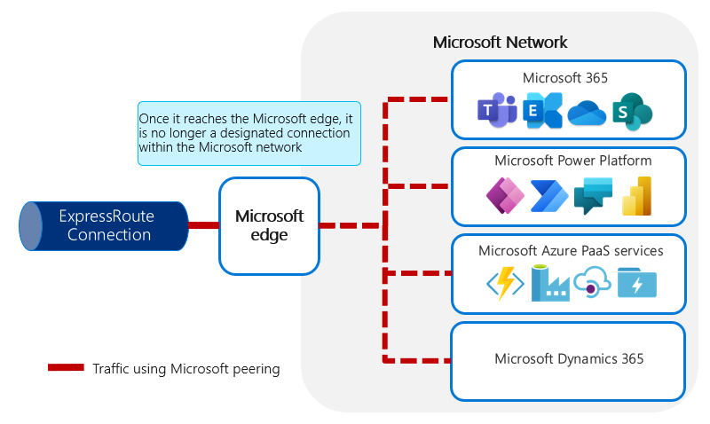
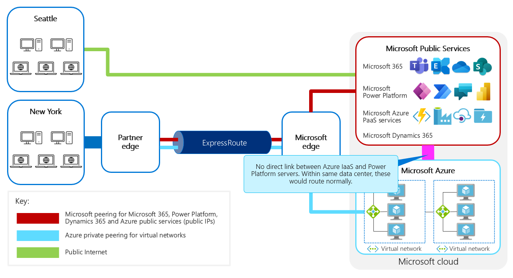

# How ExpressRoute works with Microsoft Power Platform?

To understand how ExpressRoute works with Microsoft Power Platform, you need to
know the basics of how ExpressRoute works first.

An ExpressRoute circuit represents a logical connection between your on-premises
infrastructure and Microsoft cloud services through a connectivity provider. You
can order multiple ExpressRoute circuits. Each circuit can be in the same or
different regions and can be connected to your premises through different
connectivity providers.

Connectivity providers are set of partners who help you set up the ExpressRoute so
that your on-premises infrastructure and Microsoft cloud can be connected. For the
complete list of ExpressRoute connectivity partners, see [ExpressRoute connectivity providers](/azure/expressroute/expressroute-locations#partners). the availability of these providers will depend on the location you choose
to connect from.

An ExpressRoute circuit can offer performance advantages because a dedicated and
optimized connection is set up directly through the ExpressRoute connectivity
provider’s infrastructure to the edge of the Microsoft network. This connection
could be optimized without ExpressRoute, but Internet connectivity is typically
provided through a series of partnerships and relationships between
telecommunications providers, which can lead to suboptimal connectivity paths
being taken to delivering a customer’s network traffic to a specific
destination.

The agreement to provide a dedicated and private connection with a connectivity
provider ensures that there is a direct responsibility for the connectivity
provider to set up an optimized connection direct to the Microsoft network, and
this ownership is often what leads to the optimized experience.

Each circuit has fixed bandwidth; the bandwidth limitation is dependent on
[which plan you
choose](https://azure.microsoft.com/pricing/details/expressroute/). This circuit
is mapped to a connectivity provider and a peering location. The available
bandwidth is shared across the peerings for the circuit. A circuit can have up
to two separate peerings. These peerings represent different routings used
depending on which kind of service is being requested:

-   **Microsoft peering**: routes requests to Microsoft public services such as
    Microsoft 365, Microsoft Dynamics 365 or Microsoft Power Platform services

-   **Private peering**: routes requests to the customer’s private Azure
    services, for example, IaaS Virtual Machines

Each peering is a pair of independent Border Gateway Protocol (BGP) sessions,
each configured redundantly for high availability. To ensure true resilience,
it’s important to ensure that they transit over physically different
connections.

Microsoft advertises the IP subnets or prefixes of the cloud services to the
public Internet. Microsoft also advertises the IP prefixes for the relevant
services through the ExpressRoute BGP connection for the services specified in
the peerings defined for that circuit.

For traffic to Microsoft, internal routing configuration within the customer
network needs to set up and is responsible for:

-   Prioritizing the route for Microsoft Online Services traffic via the subnet
    connected to ExpressRoute as opposed to through the public Internet
    connection

-   Routing the Microsoft Online Services traffic from the connected subnet
    through the BGP session established through ExpressRoute

At the other side, Microsoft is then responsible for routing the traffic to the
appropriate service within the Microsoft datacenter.

For traffic routed from Microsoft Online Services to an external service:

![Diagram of network traffic routed from Microsoft online services to an external service. Requests to external services are looked up against DNS. If the IP is registered against an ExpressRoute circuit, routes it internally. Traffic to IP registered against ExpressRoute routed over the BGP session through the customer private circuit goes to ExpressRoute connection. Router configration routes traffic internally as appropriately either using public IP or NAT IP. Lastly, connection is made to the internal service.](media/traffic-route-msol-external.png "Traffic routed from Microsoft online sevices to an external service.")

When the request is made:

-   It must be made through a public URL, which must first be resolved to a
    public IP address.

-   If the IP address is registered against an ExpressRoute peering, the traffic
    will be routed internally to be sent via the appropriate ExpressRoute
    circuit.

-   If not, the routing configuration within the online service will route the
    traffic out to the public Internet.

-   Once the traffic arrives at the customer network, internal routing within
    the customer network will be responsible for routing it to the final
    destination either through direct routing of the IP or through NAT first.

You must connect to Microsoft cloud services only from a subnet that uses public
IP addresses that are owned by you or your ExpressRoute connectivity provider.
If you are using private IP addresses in your on-premises network, you or your
provider need to translate the private IP addresses to the public IP addresses
using NAT before connecting to ExpressRoute. This enables requests from
Microsoft services to resolve to the service endpoint and route through the
network across shared network segments.

## ExpressRoute Peerings

One critical factor to consider is that ExpressRoute does not currently allow
you to directly configure specific services to be transported across the
ExpressRoute circuit, but rather it allows you to enable groups of services
called peerings.

There are two types of ExpressRoute peerings: Microsoft and private.

### Microsoft Peering

Configuring ExpressRoute for Power Platform services requires Microsoft Peering,
which by default will jointly route both Power Platform services and Microsoft
365 via ExpressRoute.

This means that the traffic will be routed to go to public IP ranges that are
used by the above services.

It is possible to use Border Gateway Protocol (BGP) Communities to configure the
network to route traffic only for certain services, such as only Microsoft Teams
or only SharePoint Online services, through an ExpressRoute Microsoft Peering
circuit. This is currently not supported for Power Platform and alternatives are
explained here.

Connectivity to Microsoft online services such as Microsoft 365 and Power
Platform services will be routed through the Microsoft peering. Microsoft
assigns the URLs and IPs for Power Platform, Dynamics 365 Customer Engagement
applications and Microsoft 365 services to the Microsoft Peering, so any traffic
routed to them will be advertised and enabled through the Microsoft Peering.
Unlike Microsoft 365, Power Platform does not have designated BGP
communities. (BGP communities are covered here).

Using Microsoft peering, the connections are to shared services at Microsoft so
once they arrive at the Microsoft datacenter, the ongoing connection is across
an internal shared network, the private connection provided by ExpressRoute does
not extend all the way to the destination service endpoint itself.

### Private Peering

Private peering is used for Azure IaaS services private to the customer and not
directly used by Power Platform services.

This type of peering typically connects to private IP addresses in an Azure
VNet.

Microsoft doesn’t utilize private services for Power Platform that would be
directly accessible by the customer. It is not necessary for Power Platform
purposes to configure private peering for ExpressRoute. If the customer
separately utilizes Azure private services, configuring private peering isn’t
harmful, unless the introduction of additional workloads causes the connection
to be saturated.

### ExpressRoute controls traffic to the Microsoft network, not within it

When connections are made to a private Azure resource such as an IaaS VM,
ExpressRoute links the connection made from the customer directly to the
customer’s private Azure resources.

For Microsoft peering, ExpressRoute is a dedicated connection between the
customer network and the edge of the Microsoft network. It is not a dedicated
connection all the way to the specific Power Platform environment for the
customer. Once the traffic reaches the Microsoft network and is identified
through the peering rules as targeting a public resource, either Azure or a
Microsoft service like Microsoft 365 or Power Platform, the end target is a
shared service so the network connection to it is also shared within the
Microsoft network.

Traffic between services in Microsoft’s data centers would route within the
Microsoft network rather than via the public Internet.

> [!div class="nextstepaction"]
> [Next step: Things to consider prior to using ExpressRoute](things-to-consider.md)
