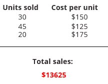

# Average, Max, Min, StdevP, Sum, and VarP functions

**Applies to:** :::image type="icon" source="media/yes-icon.svg" border="false"::: [Power Apps](../formula-reference-power-apps.md) :::image type="icon" source="media/yes-icon.svg" border="false"::: [Dataverse](../formula-reference-dataverse.md)

Aggregate functions that summarize a set of numbers.

## Description

The **Average** function calculates the average, or arithmetic mean, of its arguments.

The **Max** function finds the maximum value.

The **Min** function finds the minimum value.

The **Sum** function calculates the sum of its arguments.

The **StdevP** function calculates the standard deviation of its arguments.

The **VarP** function calculates the variance of its arguments.

You can supply the values for these functions as:

- Separate arguments. For example, **Sum( 1, 2, 3 )** returns 6.
- A [table](/power-apps/maker/canvas-apps/working-with-tables) and a formula to operate over that table. The aggregate will be calculated on the values of the formula for each [record](/power-apps/maker/canvas-apps/working-with-tables#records).

[!INCLUDE [record-scope](../../includes/record-scope.md)]

These functions operate on numeric values only. Other types of values, such as strings or records, are ignored. Use the **[Value](function-value.md)** function to convert a string into a number.

The **Average**, **Max**, **Min**, and **Sum** functions can be delegated when used with a [data source that supports delegation for these functions](/power-apps/maker/canvas-apps/delegation-overview). However, **StdevP** and **VarP** can't be delegated for any data sources. If delegation is not supported, only the first portion of the data will be retrieved and then the function applied locally. The result may not represent the complete story. A delegation warning will appear at authoring time to remind you of this limitation and to suggest switching to delegable alternatives where possible. For more information, see the [delegation overview](/power-apps/maker/canvas-apps/delegation-overview).

## Syntax

**Average**( _NumericalFormula1_, [ *NumericalFormula2*, ... ] ) **Max**( _NumericalFormula1_, [ *NumericalFormula2*, ... ] ) **Min**( _NumericalFormula1_, [ *NumericalFormula2*, ... ] ) **Sum**( _NumericalFormula1_, [ *NumericalFormula2*, ... ] ) **StdevP**( _NumericalFormula1_, [ *NumericalFormula2*, ... ] ) **VarP**( _NumericalFormula1_, [ *NumericalFormula2*, ... ] )

- _NumericalFormula(s)_ - Required. Numeric values to operate on.

**Average**( _Table_, _NumericalFormula_ ) **Max**( _Table_, _NumericalFormula_ ) **Min**( _Table_, _NumericalFormula_ ) **Sum**( _Table_, _NumericalFormula_ ) **StdevP**( _Table_, _NumericalFormula_ ) **VarP**( _Table_, _NumericalFormula_ )

- _Table_ - Required. Table to operate on.
- _NumericalFormula_ - Required. Formula to evaluate for each record. The result of this formula is used for the aggregation. You can use columns of the table in the formula.

## Examples

### Step by step

Let's say that you had a [data source](/power-apps/maker/canvas-apps/working-with-data-sources) named **Sales** that contained a **CostPerUnit** column and a **UnitsSold** column, and you set the **[Text](/power-apps/maker/canvas-apps/controls/properties-core)** property of a label to this function: 
**Sum(Sales, CostPerUnit \* UnitsSold)**

The label would show total sales by multiplying the values in those columns for each record and then adding the results from all records together: 

As a different example, let's say that you had sliders that were named **Slider1**, **Slider2**, and **Slider3** and a label with its **[Text](/power-apps/maker/canvas-apps/controls/properties-core)** property set to this formula: 
**Sum(Slider1.Value, Slider2.Value, Slider3.Value)**: The label would show the sum of all values to which the sliders were set. 
**Average(Slider1.Value, Slider2.Value, Slider3.Value)**: The label would show the average of all values to which the sliders were set. 
**Max(Slider1.Value, Slider2.Value, Slider3.Value)**: The label would show the maximum of all values to which the sliders were set. 
**Min(Slider1.Value, Slider2.Value, Slider3.Value)**: The label would show the minimum of all values to which the sliders were set. 
**StdevP(Slider1.Value, Slider2.Value, Slider3.Value)**: The label would show the standard deviation of all values to which the sliders were set. 
**VarP(Slider1.Value, Slider2.Value, Slider3.Value)**: The label would show the variance of all values to which the sliders were set.

[!INCLUDE[footer-include](../../includes/footer-banner.md)]
