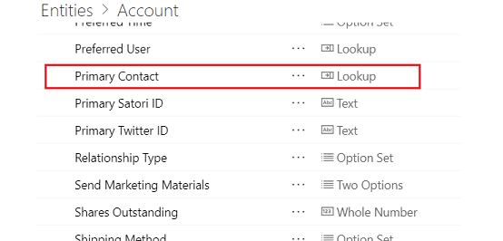
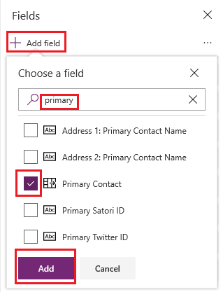
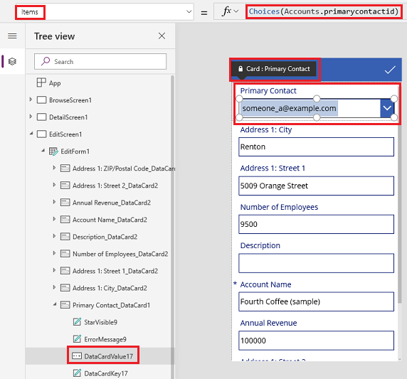

# Choices function in Power Apps

Returns a table of the possible values for a lookup column.

## Description

The **Choices** function returns a table of the possible values for a lookup column.

Use the **Choices** function to provide a list of choices for your user to select from. This function is commonly used with the [**Combo box**](/power-apps/maker/canvas-apps/controls/control-combo-box) control in edit forms.

For a lookup, the table that **Choices** returns matches the foreign table that's associated with the lookup. By using **Choices**, you eliminate the need to add the foreign table as an additional data source. **Choices** returns all columns of the foreign table.

Because **Choices** returns a table, you can use [**Filter**](function-filter-lookup.md), [**Sort**](function-sort.md), [**AddColumns**](function-table-shaping.md), and all the other table-manipulation functions to filter, sort, and shape the table.

At this time, you can't [delegate](/power-apps/maker/canvas-apps/delegation-overview) **Choices**. If this limitation poses a problem in your app, add the foreign table as a data source, and use it directly.

**Choices** doesn't require column names to be strings and enclosed in double quotes, unlike the [**ShowColumns**](function-table-shaping.md), [**Search**](function-filter-lookup.md), and other table functions. Provide the formula as if you were referencing the column directly.

Column references must be direct to the data source. For example, if the data source is **Accounts** and the lookup is **SLA**, the column reference would be **Accounts.SLA**. The reference can't pass through a function, a variable, or a control. Furthering this example, if **Accounts** is fed to a **Gallery** control, use the formula **Gallery.Selected.SLA** to reference the SLA for the selected account. However, this reference has passed through a control, so it can't be passed to the **Columns** function - you must still use **Accounts.SLA**.

At this time, you can use lookup columns only with SharePoint and Microsoft Dataverse.

## Syntax

**Choices**( _column-reference_ )

- _column-reference_ – Required. A lookup column of a data source. Don't enclose the column name in double quotes. The reference must be directly to the column of the data source and not pass through a function or a control.

## Examples

#### Choices for a lookup

1. [Create a database](/power-platform/admin/create-database) in Dataverse, and select the **Include sample apps and data** box.

   Many tables, such as **Accounts**, are created.

   **Note**: Table names are singular on make.powerapps.com and plural in Power Apps Studio.

   

   The **Accounts** table has a **Primary Contact** column, which is a lookup to the **Contacts** table.

   

   For each account, a contact is designated as the primary contact, or the primary contact is _blank_.

1. [Generate an app](/power-apps/maker/canvas-apps/data-platform-create-app) from the **Accounts** table.

1. In the list of screens and controls near the left edge, scroll down until **EditScreen1** appears, and then select **EditForm1** just under it.

   

1. On the **Properties** tab of the right pane, select **Edit fields**.

   

1. In the **Fields** pane, select **Add field**.

1. Search for the **Primary Contact** field, select its check box, and then select **Add**.

   

   The **Primary Contact** field appears at the bottom of the form. If the field shows an error, select **Data sources** on the **View** tab, select the ellipsis (...) for the **Accounts** data source, and then select **Refresh**.

1. (optional) Drag the **Primary Contact** field from the bottom to the top of the list of fields.

1. In the card for **Primary Contact**, select the **Combo box** control.

   The **Items** property of that control is set to a formula that identifies the column by either its display name, as in the first example, or its logical name, as in the second example:

   - **Choices( Accounts.'Primary Contact' )**
   - **Choices( Accounts.primarycontactid )**

     

1. For illustration purposes, we can view the complete table returned by the **Choices** function in a **Data table** control. On the **Home** tab, select **New screen**, and then select **Blank**.

1. On the **Insert** tab, select **Data table**.

1. Set the **Items** property of the **Data table** control to this formula:

   **Choices( Accounts.'Primary Contact' )**

1. In the middle of the **Data table** control, select the link that starts **Choose the fields...**, and then select the check boxes for the field or fields that you want to show (for example, **firstname** and **lastname**).

   

[!INCLUDE[footer-include](../../includes/footer-banner.md)]
