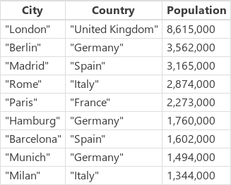
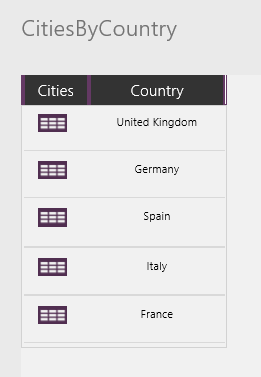
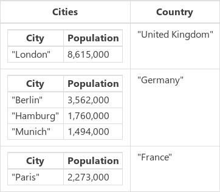
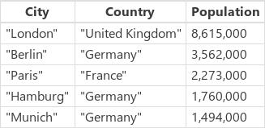
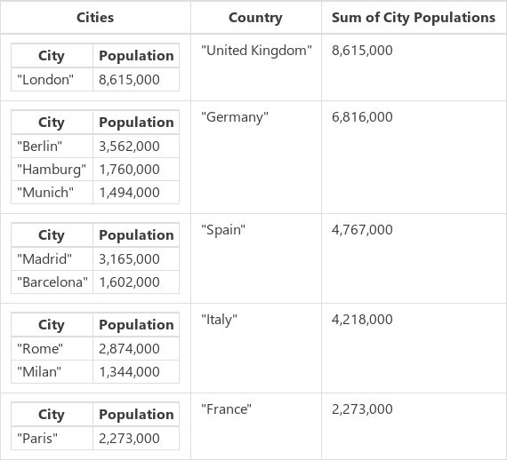
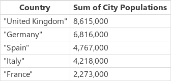

# GroupBy and Ungroup functions

**Applies to:** :::image type="icon" source="media/yes-icon.svg" border="false"::: Canvas apps :::image type="icon" source="media/yes-icon.svg" border="false"::: Model-driven apps   

Groups and ungroups [records](/power-apps/maker/canvas-apps/working-with-tables#records) of a [table](/power-apps/maker/canvas-apps/working-with-tables).

## Description

The **GroupBy** function returns a table with records grouped together based on the values in one or more [columns](/power-apps/maker/canvas-apps/working-with-tables#columns). Records in the same group are placed into a single record, with a column added that holds a nested table of the remaining columns.

The **Ungroup** function reverses the **GroupBy** process. This function returns a table, breaking into separate records any records that were grouped together.

You can group records by using **GroupBy**, modify the table that it returns, and then ungroup records in the modified table by using **Ungroup**. For example, you can remove a group of records by following this approach:

- Use the **GroupBy** function.
- Use the **[Filter](function-filter-lookup.md)** function to remove the entire group of records.
- Use the **Ungroup** function.

You can also aggregate results based on a grouping:

- Use the **GroupBy** function.
- Use the **[AddColumns](function-table-shaping.md)** function with **[Sum](function-aggregates.md)**, **[Average](function-aggregates.md)**, and other aggregate functions to add a new column, which is an aggregate of the group tables.
- Use the **[DropColumns](function-table-shaping.md)** function to drop the group table.

**Ungroup** tries to preserve the original order of the records that were fed to **GroupBy**. This isn't always possible (for example, if the original table contains _blank_ records).

A table is a value in Power Apps, just like a string or a number. You can specify a table as an argument for a function, and a function can return a table. **GroupBy** and **Ungroup** don't modify a table; instead they take a table as an argument and return a different table. See [working with tables](/power-apps/maker/canvas-apps/working-with-tables) for more details.

> [!NOTE]
> In Power Apps prior to version 3.24042, column names were specified with a text string using double quotes, and if connected to a data source they also needed to be logical names. For example, the logical name **"cr43e_name"** with double quotes was used instead of the display name **Name** without quotes. For SharePoint and Excel data sources that contain column names with spaces, each space was specified with **"\_x0020\_"**, for example **"Column Name"** as **"Column_x0020_Name"**. Afer this version, all apps were automatically updated to the new syntax described in this article. 

## Syntax

**GroupBy**( _Table_, _ColumnName1_ [, *ColumnName2*, ... ], _GroupColumnName_ )

- _Table_ - Required. Table to be grouped.
- _ColumnName(s)_ - Required. The column names in _Table_ by which to group records. These columns become columns in the resulting table.
- _GroupColumnName_ - Required. The column name for the storage of record data not in the _ColumnName(s)_.

**Ungroup**( _Table_, _GroupColumnName_ )

- _Table_ - Required. Table to be ungrouped.
- _GroupColumnName_ - Required. The column that contains the record data setup with the **GroupBy** function.

## Examples

### Create a collection

1. Add a button, and set its **[Text](/power-apps/maker/canvas-apps/controls/properties-core)** property so that the button shows **Original**.
2. Set the **[OnSelect](/power-apps/maker/canvas-apps/controls/properties-core)** property of the **Original** button to this formula:

```powerapps-dot
ClearCollect( CityPopulations,
    { City: "London",    Country: "United Kingdom", Population: 8615000},
    { City: "Berlin",    Country: "Germany",        Population: 3562000},
    { City: "Madrid",    Country: "Spain",          Population: 3165000},
    { City: "Rome",      Country: "Italy",          Population: 2874000},
    { City: "Paris",     Country: "France",         Population: 2273000},
    { City: "Hamburg",   Country: "Germany",        Population: 1760000},
    { City: "Barcelona", Country: "Spain",          Population: 1602000},
    { City: "Munich",    Country: "Germany",        Population: 1494000},
    { City: "Milan",     Country: "Italy",          Population: 1344000}
)
```

3. While holding down the Alt key, select the **Original** button.

   You just created a [collection](/power-apps/maker/canvas-apps/working-with-data-sources#collections), named **CityPopulations**, that contains this data:
   
   

4. To display this collection, select **Collections** on the **File** menu and then select the **CityPopulations** collection. The first five records in the collection appear:

   

### Group records

1. Add another button, and set its **[Text](/power-apps/maker/canvas-apps/controls/properties-core)** property to **"Group"**.
2. Set the **[OnSelect](/power-apps/maker/canvas-apps/controls/properties-core)** property of this button to this formula:

   **ClearCollect( CitiesByCountry, GroupBy( CityPopulations, Country, Cities ) )**

3. While holding down the Alt key, select the **Group** button.

   You just created a collection, named **CitiesByCountry**, in which the records of the previous collection are grouped by the **Country** column.

   

4. To display the first five records in this collection, select **Collections** on the **File** menu.

   

5. To display the populations of cities in a country/region, select the table icon in the **Cities** column for that country/region (for example, Germany):

   

### Filter and ungroup records

1. Add another button, and set its **[Text](/power-apps/maker/canvas-apps/controls/properties-core)** property so that the button shows **"Filter"**.
2. Set the **[OnSelect](/power-apps/maker/canvas-apps/controls/properties-core)** property of this button to this formula:

   **ClearCollect( CitiesByCountryFiltered, Filter( CitiesByCountry, "e" in Country ) )**

3. While holding down the Alt key, select the button that you added.

   You just created a third collection, named **CitiesByCountryFiltered**, that includes only those countries that have an "e" in their names (that is, not Spain or Italy).

   

4. Add one more button, and set its **[Text](/power-apps/maker/canvas-apps/controls/properties-core)** property so that the button shows **"Ungroup"**.
5. Set the **[OnSelect](/power-apps/maker/canvas-apps/controls/properties-core)** property of this button to this formula:

   **ClearCollect( CityPopulationsUngrouped, Ungroup( CitiesByCountryFiltered, Cities ) )**

   Which results in:

   

### Aggregate results

Another operation we can perform on a grouped table is to compile the results. In this example, we'll sum the population of the major cities in each country/region.

1. Add another button, and set its **[Text](/power-apps/maker/canvas-apps/controls/properties-core)** property so that the button shows **"Sum"**.
2. Set the **[OnSelect](/power-apps/maker/canvas-apps/controls/properties-core)** property of the **"Sum"** button to this formula:

   **ClearCollect( CityPopulationsSum, AddColumns( CitiesByCountry, 'Sum of City Populations', Sum( Cities, Population ) ) )**

   Which results in:

   

   **[AddColumns](function-table-shaping.md)** starts with the base **CitiesByCountry** collection and adds a new column **Sum of City Populations**. This column's values are calculated row-by-row, based on the formula **Sum( Cities, Population )**. **AddColumns** provides the value of the **Cities** column (a table) for each row, and **[Sum](function-aggregates.md)** adds up the **Population** for each row of this sub table.

   Now that we have the sum that we want, we can use **[DropColumns](function-table-shaping.md)** to remove the sub tables.

4. Add another button, and set its **[Text](/power-apps/maker/canvas-apps/controls/properties-core)** property so that the button shows **"SumOnly"**.
5. Set the **[OnSelect](/power-apps/maker/canvas-apps/controls/properties-core)** property of the **"SumOnly"** button to this formula:

   **ClearCollect( CityPopulationsSumOnly, DropColumns( CityPopulationsSum, Cities ) )**

   Which results in:

   

   Note that we didn't need to ungroup this table.

[!INCLUDE[footer-include](../../includes/footer-banner.md)]
