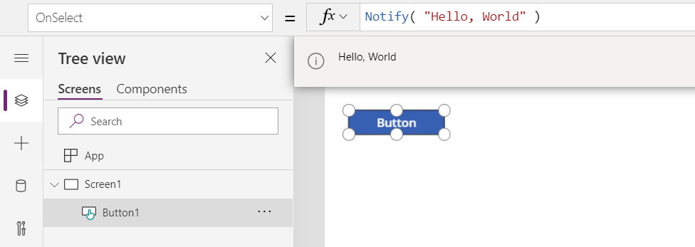
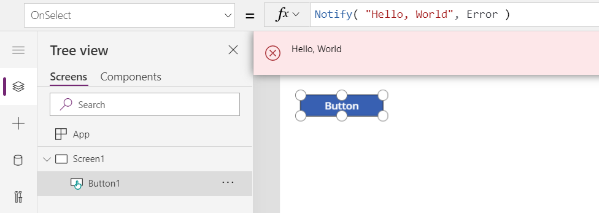

# Notify function

**Applies to:** :::image type="icon" source="media/yes-icon.svg" border="false"::: Canvas apps :::image type="icon" source="media/yes-icon.svg" border="false"::: Model-driven apps :::image type="icon" source="media/yes-icon.svg" border="false"::: Power Platform CLI

Displays a banner message to the user.

## Description

The **Notify** function displays a banner message to the user at the top of the screen. The notification remains until the user dismisses it or the timeout expires which defaults to 10 seconds.

An appropriate color and icon are used depending on the type of the message. The type is specified by the second argument to the function:

> [!NOTE]
> The character limit for **Notify** function is 500 characters.

| NotificationType Argument                  | Description                            |
| ------------------------------------------ | -------------------------------------- |
| **NotificationType.Error**                 | Displays the message as an error.      |
| **NotificationType.Information** (Default) | Displays the message as informational. |
| **NotificationType.Success**               | Displays the message as success.       |
| **NotificationType.Warning**               | Displays the message as a warning.     |

Messages are shown both when authoring your app and when end users are using your app.

**Notify** can only be used in [behavior formulas](/power-apps/maker/canvas-apps/working-with-formulas-in-depth).

**Notify** can be paired with the [**IfError**](function-iferror.md) function to detect and report errors with a custom error message.

Power Apps can also send push notifications using an entirely different mechanism from **Notify**. For more information, see [Send a notification in Power Apps](/power-apps/maker/canvas-apps/add-notifications).

**Notify** always returns _true_.

Note: This function was previously named **ShowError** when it could only display error messages.

>[!NOTE]
> Notify can be used in [standalone canvas app](/power-apps/maker/canvas-apps/working-with-formulas), [custom page](/power-apps/maker/model-driven-apps/page-powerfx-in-model-app) and [Power Fx commanding](/power-apps/maker/model-driven-apps/commanding-use-powerfx) experiences. The default values for NotificationType and Timeout vary by the experience its used in. You can specify the values you want set for NotificationType and Timeout by explicitly setting them in your Power Fx expression and these values will be respected regardless of the experience. 


## Syntax

**Notify**( _Message_ [, _NotificationType_ [ , *Timeout* ] ] )

- _Message_ – Required. Message to display to the user.
- _NotificationType_ – Optional. Type of the message to display from the table above. The default is **NotificationType.Information**.
- _Timeout_ – Optional. Number of milliseconds to wait before automatically dismissing the notification. The default is 10 seconds (or 10,000 milliseconds). The notification is displayed indefinitely with a _Timeout_ of 0.

## Examples

### Step by step

1. Add a **Button** control to your screen.

2. Set the **OnSelect** property of the **Button** to the formula:

   ```powerapps-dot
   Notify( "Hello, World" )
   ```

3. Click or press the button.

   Each time the button is clicked, the message **Hello, World** is displayed to the user as informational. It dismisses  automatically in 10 seconds (default timeout) if the user doesn't dismiss it or press the button again.

   

4. Change the type of message to indicate an error. Add a second argument to our formula:

   ```powerapps-dot
   Notify( "Hello, World", NotificationType.Error )
   ```

5. Click or press the button.

   Now each time the button is clicked, the message **Hello, World** is displayed to the user as an error. It dismisses automatically in 10 seconds (default timeout) if the user doesn't dismiss it or press the button again.

   

6. Change the type of message to indicate a warning. Change the second argument in our formula:

   ```powerapps-dot
   Notify( "Hello, World", NotificationType.Warning, 4000 )
   ```

7. Click or press the button.

   Now each time the button is clicked, the message **Hello, World** is displayed to the user as a warning. It dismisses automatically in 4 seconds (4,000 milliseconds) if the user doesn't dismiss it or press the button again.

   

8. Change the type of message to indicate success. Change the second argument in our formula:

   ```powerapps-dot
   Notify( "Hello, World", NotificationType.Success, 0 )
   ```

9. Click or press the button.

   Now each time the button is clicked, the message **Hello, World** is displayed to the user as success. With a **0** timeout, the notification will only be dismissed by the user or by pressing the button again.

   

[!INCLUDE[footer-include](../../includes/footer-banner.md)]
