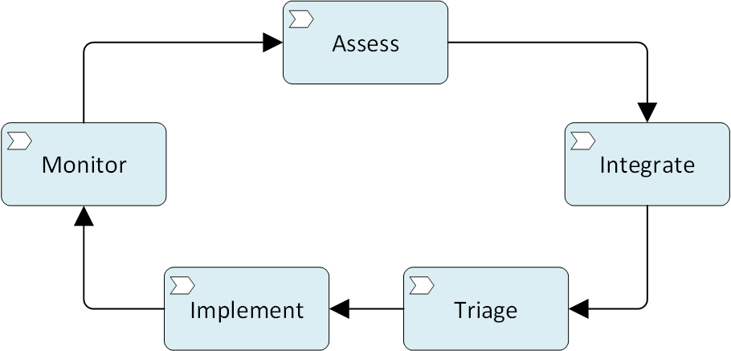

# Complete a Power Platform Well-Architected assessment

[Power Platform Well-Architected Review](https://aka.ms/powa/assessment) is a tool comprising questions that are based on the key recommendations provided in the pillars of Power Platform Well-Architected.

When you complete an assessment, you are provided with recommendations and corresponding links to supporting material that can help you improve your workload's design. You can export these recommendations into a file that you can use to incorporate the recommendations into the operational processes for continuous improvement of your workload.

## When to take the assessment

For new workloads, we recommend that you perform the assessment during the initial design process, entering the proposed decisions. The guidance then acts as a baseline and starts a feedback loop that you can use to refine the workload design as you make more design decisions and periodically capture them in more assessment milestones.

Existing workloads should be examined as well, as part of the continuous improvement cycle of the workload. Set a cadence, such as every 90 days, and use milestones to track how the workload design can continue to improve.

## Receive and integrate recommendations

After you complete an assessment, the recommendations for your current milestone are available on the assessment's guidance page. Export these recommendations by selecting the **Export to CSV** button. You can use the offline copy to share the recommendations and start to prioritize them. Although some teams might consider the CSV file sufficient, we recommend that you add the recommendations to the workload's backlog so they can be integrated into the workload's software development lifecycle (SDLC).

## Prioritize and implement recommendations

Workload owners and key stakeholders should prioritize the recommendations in alignment with the team's standard processes for work prioritization.  Consider how relevant each recommendation is and any tradeoffs that might come with particular design choices. Certain recommendations could be allocated to designated owners, while others may be delayed or rejected. You should add the recommendations to the workload's backlog and integrate them into your SDLC.

## Monitor improvements

Over time, the workload will evolve due to functionality changes, eliminating or accruing technical debt, and making tradeoffs. Use the milestone feature of the assessment to track this change over time, using the prior milestone as a baseline. You'll see the change over time in the [Power Platform Well-Architected Review](https://aka.ms/powa/assessment).

## Tips

- Be sure to sign in when you take assessments so that the tool can generate milestones.

  > [!WARNING]
  > Assessments are tied to a Microsoft Learn profile. They can't be transferred to or accessed by other profiles.

- Choose a meaningful name for the assessment, and be sure to include the name of the pillar in the assessment's name.
- Use meaningful milestone names to indicate when you're evaluating the workload.
  Ccapture any specifics that you want to discuss with the workload team in the notes feature on questions and on recommendations.
- Consider taking the assessment one pillar at a time, staggered by month, rather than answering all the questions across all five pillars in one assessment. 

## Next step

> [!div class="nextstepaction"]
> [Complete a Power Platform Well-Architected Review](https://aka.ms/powa/assessment)
