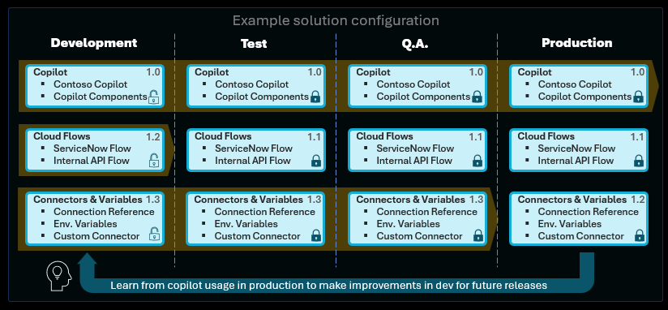

# Publishing considerations for intelligent application workloads

It’s key to have a healthy application lifecycle management (ALM) process to avoid production issues and catch and fix any regression early.

- Use the [Power CAT Copilot Studio Kit](https://github.com/microsoft/Power-CAT-Copilot-Studio-Kit) to configure copilots and tests. By running individual tests against the Copilot Studio APIs (Direct Line), the copilot responses are evaluated against expected results.

## Example

## See also:

- [Use environment variables](/power-apps/maker/data-platform/environmentvariables)
- [Power Platform ALM](/power-platform/alm/)
- [Power Platform pipelines](/power-platform/alm/pipelines)
- [Azure DevOps Power Platform Build Tools](/power-platform/alm/devops-build-tools)
- [GitHub Power Platform Actions](/power-platform/alm/devops-github-actions)
- [Test Framework](https://aka.ms/PVASamples/PVATestFramework)
