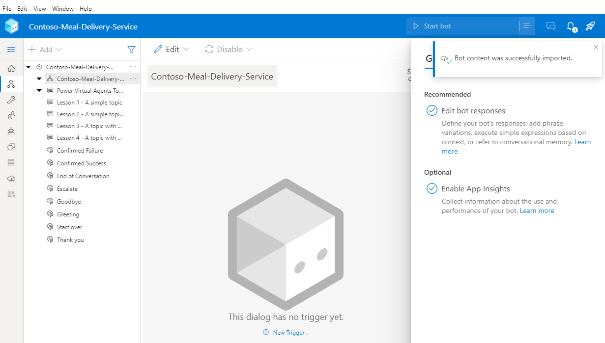
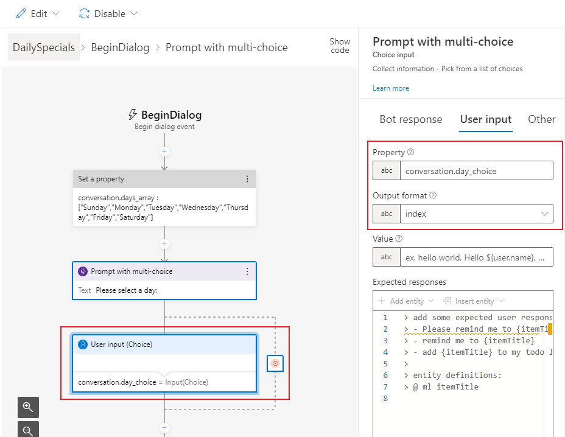
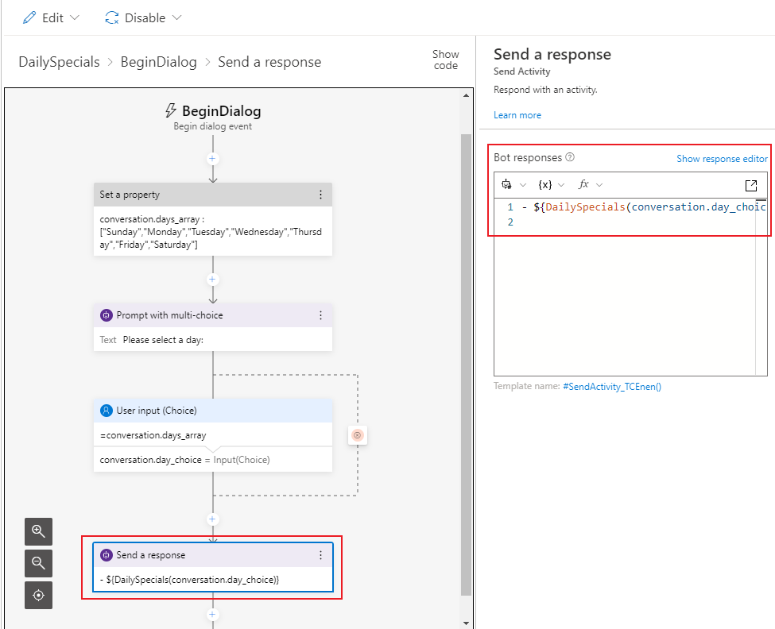
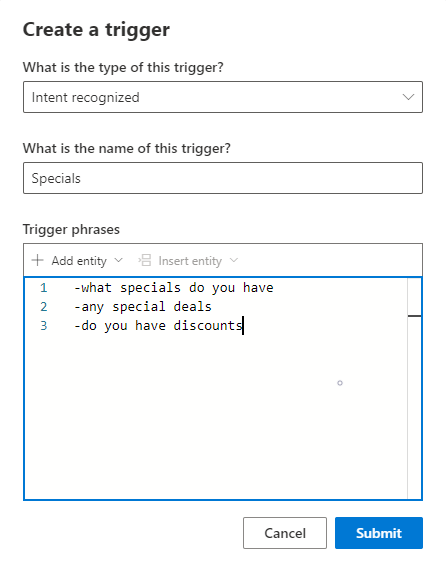
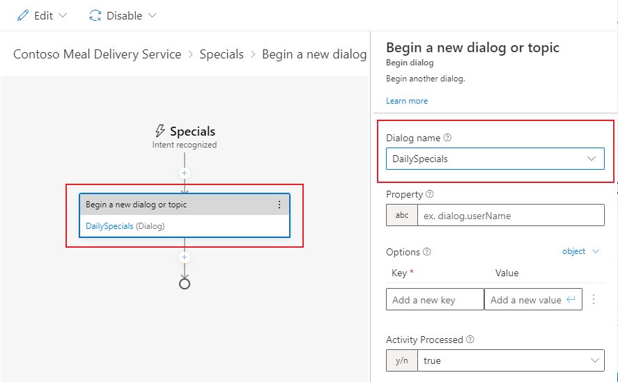

# Extend your bot with Bot Framework Composer

You can enhance your bot by developing custom dialogs with [Bot Framework Composer](/composer/) and then adding them to your Power Virtual Agents bot. 

Composer is integrated into Power Virtual Agents to allow developers and business users to build bots together. Composer lets you extend your bot with Bot Framework functionality, including:
- Adaptive dialogs
- Language Generation (LG)
- Regular expressions (RegEx)
- Adaptive Cards 

Composer with Power Virtual Agents lets you access conversational memory and context, including the variables defined in Power Virtual Agents. 

For example, you could create event-driven dynamic dialogs to handle interruptions, cancelations and context switching. You could also add Adaptive Cards to display interactive elements like images and videos, forms, and more in the bot. 

Composer lets you use a variety of prebuilt functions and expressions and define multiple variations of a phrase for the bot to select at random at runtime.

Custom dialogs added with Bot Framework Composer are deployed, hosted, and executed together with the rest of Power Virtual Agents bot content, and do not require any additional Azure hosting.

>[!IMPORTANT]
>Bot Framework Composer integration is not available to users who only have the [Teams Power Virtual Agents license](requirements-licensing-subscriptions.md). You must have a [trial](sign-up-individual.md) or full Power Virtual Agents license.


## Prerequisites

- [Introduction to Bot Framework Composer](/composer/introduction)
- [!INCLUDE [Medical and emergency usage](includes/pva-usage-limitations.md)]

## Access Bot Framework Composer from within Power Virtual Agents 
1. Go to the **Topics** tab for the bot you want to edit and click on **+ New topic** dropdown.

2. Select **Open in Bot Framework Composer** from the dropdown menu. 

    

If you already have Composer installed, Power Virtual Agents will try to open your bot in Composer. 

>[!IMPORTANT]
>You should always open Bot Framework Composer from within Power Virtual Agents if you plan to create content for Power Virtual Agents bots. This will ensure that Composer has all the necessary plugins needed for integration with Power Virtual Agents. 


If you don't have Composer installed, you can download it from the **download Composer** link. This link takes you to a **Download confirmation** window where you can also learn more about Composer.
    

    
   
During installation, make sure to unselect the **Run Bot Framework Composer** checkbox, since you will need to open Composer application from within Power Virtual Agents to use it with your bot. 


Go back to Power Virtual Agents **Topics** page. Select **Open in Bot Framework Composer** and then **Open Composer** to open your bot in Composer.


>[!NOTE]
> In some cases, a firewall might be blocking some features in Composer and you might need to explicitly allow access. Check with your admin for details.

If you're opening Composer from this Power Virtual Agents bot for the first time, you need to specify the **Name** (alphanumeric, no spaces or special characters) for your **Composer project**. You can skip this step if you already have a bot project for this bot by selecting **Cancel** in this step.


Your Power Virtual Agents bot is now open in Composer and you are ready to start developing.



>[!NOTE]
> In some cases, Power Virtual Agents might be unable to launch Composer automatically. However, you can always launch it manually from your browser.
Use the **Copy Link** feature to copy the link to the Composer and paste it as the URL in your web browser.

## Guidelines for creating bot content for Power Virtual Agents in Composer
When opened from a Power Virtual Agents bot, Composer launches a **Composer project** on your PC and loads your bot content into it.

The **main (root) dialog** in your **Composer project** is the same as the project name you gave it. It corresponds to your Power Virtual Agents bot content. In this example below, your **main (root) dialog** is **Contoso-Meal-Delivery-Service**: 


There are few key guidelines to follow when using Composer to create your bot content for Power Virtual Agents.

- The Power Virtual Agents topics from your bot will be displayed in Composer. You can't edit these Power Virtual Agents topics in Composer; clicking on them will open these topics in Power Virtual Agents for editing.


- You can call Power Virtual Agents topics in Composer by using **Begin a PVA Topic** option.


- You can add new **Bot Framework triggers** of any kind to your **main (root) dialog**. You can use **Send a response**, **Ask a question**, and **Language Generation** in the new **triggers** added to **main (root) dialog**.

- You can't use the Regular expression recognizer (RegEx) in the **main (root) dialog**. Using the Regular expression recognizer in the **main (root) dialog** will prevent you from publishing your Composer content to Power Virtual Agents. However, you can use the Regular expression recognizer in any other Composer dialogs.

- You can create new **Bot Framework dialogs** and add **events** and **triggers** of any kind to them. **Send a response**, **Ask a question**, and **Language Generation** can be used in **triggers** that belong to the new **dialogs**.

- On the **Bot Responses** tab, the **All** section should be empty (that is, the **common.lg** file should be empty). Having any assets there will result in validation errors and prevent you from publishing your Composer content to Power Virtual Agents.

- All **Language Generation** (.lg) and **Language Understanding** (.lu) files should have the corresponding **dialogs**. For example, if you have only one **dialog** with name **dialog1**, then you can have **dialog1.en-us.lg** and **dialog1.en-us.lu**, but you cannot have **extra.en-us.lg**.

- The **main (root) dialog** in Composer should never be deleted, as it corresponds to your Power Virtual Agents bot. The **main (root) dialog** can have zero or more **triggers**.

For a deep-dive on Bot Framework Composer **dialogs**, **events**, **triggers** and how to create advanced bot content with Bot Framework, refer to the following resources:

- [Bot Framework Composer dialogs](/composer/concept-dialog)
- [Bot Framework Composer events and triggers](/composer/concept-events-and-trigger)
- [Language Generation](/composer/concept-language-generation)
- [Conversation flow and memory](/composer/concept-memory)


## Composer features not supported with Power Virtual Agents
The following Bot Framework Composer features are not supported with Power Virtual Agents:

- LUIS Recognizer  
Default Recognizer in Composer is set to Power Virtual Agents NLU


- Bot Framework Orchestrator  
Bot Framework Orchestrator is not suported in Composer for Power Virtual Agents

- Custom recognizer  
Custom recognizer is not supported in Composer for Power Virtual Agents

- Bot Skills  
Cannot invoke Bot Skills in Composer content meant for Power Virtual Agents

- QnA Maker  
This feature is not available in Composer for Power Virtual Agents

- OAuth Login and User Sign Out  
These types of actions are not supported in Composer for Power Virtual Agents

- Dialog Inputs and Outputs  
Dialog Inputs and Outputs are not supported in Composer for Power Virtual Agents

- Entity detection in trigger phrases in Composer  
Cannot use `# getUserName  - my name is {username=userName}` in Composer

- Testing in Bot Framework Emulator  
All Composer content should be published and then tested in Power Virtual Agents  

## Example 1 – Show an Adaptive Card in Power Virtual Agents 

Go to **Topics** in Power Virtual Agents and create a new topic called **Meal delivery options**. Add the following trigger phrases for this new topic:
- what meals can I order
- what meal options do you have
- what dishes do you deliver
- entrees available for delivery 

Select **Save** to save your new topic and then select **Go to authoring canvas** to create your dialog.

In the **Authoring canvas**, create a **Question** node to ask the user about their location and make sure to select entity **City** from the dropdown list in the **Identity** field.
Rename the output variable **Var** to **user_city**. Set the variable **Usage** to **Bot (any topic can access)** and **Save** the topic.


Next, you will enhance the topic **Meal delivery options** to show the images of the meal choices available in your user’s city by extending your bot with Bot Framework Composer content. Go back to **Topics** page and click on **Open in Bot Framework Composer** in **+ New Topic** dropdown menu to launch Bot Framework Composer.

Your Power Virtual Agents bot will open in a Bot Framework Composer project. You will see the list of all Power Virtual Agents topics in your bot in Composer, but they are not editable. The **Recognizer Type** field is set to **Default Recognizer**, which is **Power Virtual Agents NLU**.

>[!TIP]
>The **LUIS** service is not supported as a Recognizer for Power Virtual Agents in Composer. The **Default Recognizer** is set to **Power Virtual Agents NLU** instead. You do not need to have an additional subscription to use **Power Virtual Agents NLU** because it is included in your Power Virtual Agents license.

Go to the **Create** tab in Composer and select **Add a dialog** in the dropdown menu:


Name your new dialog **Meals**. Select **OK** to create a new dialog **Meals** in Composer. You will use this **Bot Framework dialog** to display an Adaptive Card.


Go to the **Bot Responses** tab in Composer and open the **Meals** section. Select **Show code**.

In the code window, copy and paste the following LG templates that you will use in your Adaptive Card:
```JSON
# Chicken()
-Chicken

# Steak()
-Steak

# Tofu()
-Tofu

# SteakImageURL()
-https://contososcubademo.azurewebsites.net/assets/steak.jpg
# ChickenImageURL()
-https://contososcubademo.azurewebsites.net/assets/chicken.jpg
# TofuImageURL()
-https://contososcubademo.azurewebsites.net/assets/tofu.jpg

```


Next, add the Adaptive Card by adding the following JSON code to the same window. This Adaptive Card takes a parameter and displays a set of three images based on the image URLs.

````JSON
# adaptivecardjson_meals(location)
- ```
{
    "type": "AdaptiveCard",
    "$schema": "http://adaptivecards.io/schemas/adaptive-card.json",
    "version": "1.1",
    "body": [
            {
            "type": "TextBlock",
            "text": "Meal delivery options for ${location}:",
            "size": "Medium",
            "weight": "Bolder"
        },
        {
            "type": "ColumnSet",
            "columns": [
                {
                    "type": "Column",
                    "width": "stretch",
                    "items": [
                        {
                            "type": "Image",
                            "url": "${SteakImageURL()}",
                            "size": "Stretch",
                            "spacing": "Medium",
                            "horizontalAlignment": "Center"
                        }
                    ]
                },
                {
                    "type": "Column",
                    "width": "stretch",
                    "items": [
                        {
                            "type": "Image",
                            "url": "${ChickenImageURL()}",
                            "horizontalAlignment": "Center"
                        }
                    ]
                },
                {
                    "type": "Column",
                    "width": "stretch",
                    "items": [
                        {
                            "type": "Image",
                            "url": "${TofuImageURL()}",
                            "horizontalAlignment": "Center"
                        }
                    ]
                }
            ]
        },
        {
            "type": "ColumnSet",
            "columns": [
                {
                    "type": "Column",
                    "width": "stretch",
                    "items": [
                        {
                            "type": "TextBlock",
                            "text": "${Steak()}",
                            "wrap": true,
                            "horizontalAlignment": "Center"                            
                        }
                    ]
                },
                {
                    "type": "Column",
                    "width": "stretch",
                    "items": [
                        {
                            "type": "TextBlock",
                            "text": "${Chicken()}",
                            "wrap": true,
                            "horizontalAlignment": "Center"
                        }
                    ]
                },
                {
                    "type": "Column",
                    "width": "stretch",
                    "items": [
                        {
                            "type": "TextBlock",
                            "text": "${Tofu()}",
                            "wrap": true,
                            "horizontalAlignment": "Center"
                        }
                    ]
                }
            ]
        }
    ]
}
```
````

  


Add the **Activity** that will display this Adaptive Card in the Bot Framework dialog to the same window in Composer:

```JSON
# AdaptiveCardMeals(location)
[Activity
    Attachments = ${json(adaptivecardjson_meals(location))}
]

```


Go back to **Create** tab in Composer and select the **Meals** dialog. Select **BeginDialog** and add **Send a response** to your dialog. We'll use this node to display the Adaptive Card we have created in the **Bot Responses** tab.

For the new **Send a response** action, the **Language Generation** panel will open on the side in Composer. Click on **Show code** button and add the following expression to this window to show the Adaptive Card and pass a Power Virtual Agents global variable `user_city` as a parameter: 

```JSON
- ${AdaptiveCardMeals(virtualagent.user_city)}
```


>[!TIP]
>You can [access Power Virtual Agents global variables in Composer](#use-power-virtual-agents-variables-in-bot-framework-composer) by referencing the scope **virtualagent**. For example, **${virtualagent.user_city}** will refer to the value of a variable that was created in the Power Virtual Agents bot.


You are now ready to upload the **Meals** dialog to your Power Virtual Agents bot. Select the **Publish** tab and then the **Publish profile** of your bot, and choose **Publish to selected profile**. Add an optional comment and select **Okay** in the confirmation window to start uploading.


The Composer content will be validated by Power Virtual Agents and a successful publish will be reported in Composer.

Go to the Power Virtual Agents **Topics** page to see your new Bot Framework content. Your new **Meals** Bot Framework dialog is now shown on the **Topics** page as part of your Power Virtual Agents bot.


Open the **Meal delivery options** topic in **Authoring canvas** in Power Virtual Agents. Under the **Question** node, add a new **Go to another topic** node, and choose the Bot Framework dialog **Meals** from the list of available topics. Note that you can continue building your dialog in Power Virtual Agents afer calling a Bot Framework Composer dialog if you wish.

Your Power Virtual Agents topic **Meal delivery options** will call the Bot Framework dialog **Meals** to display an Adaptive Card. Select **Save** to save the changes to your topic.


To test you changes in Power Virtual Agents, open **Test pane** and make sure **Track between topics** is set on. Type in the following text to start your conversation:
- What meals do you deliver?


## Example 2 – Display a multi-select options list in Power Virtual Agents 

Using Composer, you can create a multi-select options list to be used in your chatbot.

Open the Power Virtual Agents bot used in the [Example 1](#example-1--show-an-adaptive-card-in-power-virtual-agents) and select **Open in Bot Framework Composer (Preview)** on the **Topics** page to open the bot in Composer. 

While in **Create** tab in Composer select **+ Add** and choose to add another Bot Framework dialog.

Name your new dialog **DailySpecials** in Composer.


In your new **DailySpecials** dialog in Composer, go to **Manage properties** and select **Set a property** to create a new Composer property in the dialog.


Give this property the following name in the **Set a property** panel on the right:

```JSON
conversation.days_array
```
In the **Value** field in the **Set a property** panel, change the type to **\[\]** to indicate that this property is going to be an array. Enter the following data into the **Value** field to create an array populated with days of the week:

```JSON
["Sunday", "Monday", "Tuesday", "Wednesday", "Thursday", "Friday", "Saturday"]
```


Next, go to **Bot Responses** tab in Composer and select **DailySpecials**. Select **Show code**.


Add the following template to the **Bot Responses** tab for **DailySpecials** to create daily offers for all the days of the week:

```JSON
# DailySpecials(day)
- SWITCH: ${day}
- CASE: ${0}
    - All tofu meals are 10% off on Sundays!
    - Every Sunday, all tofu entrees are 10% off.
- CASE: ${1}
    - All steak options are 10% off on Mondays!
    - Enjoy your Monday with a special offer of 10% off on all steak dishes!
- CASE: ${2}
    - All the chicken meal options are 10% off on Tuesdays!
    - Tuesday special is 10% off on all the chicken dishes!
  - CASE: ${3}
    - All the chicken and tofu meal options are 10% off on Wednesdays!
    - Wednesday special is 10% off on all the chicken and tofu dishes!
  - CASE: ${4}
    - On Thursdays, get a free delivery in Seattle, Bellevue, and Redmond on all orders over $80!
    - Thursday special is a free delivery on orders over $80 in Seattle, Bellevue, and Redmond.
- CASE: ${5} 
    - Friday special - get a 10% discount on all dishes and delivery is free on all orders over $80!
    - Every Friday, we offer 10% off on all meals and a free delivery on orders over $80!
- CASE: ${6}
    - On Saturdays, we have a free delivery on all orders over $50.
    - Free delivery on all orders over $50 on Saturdays!
- DEFAULT:
    - Holiday special - free delivery anywhere in Seattle, Bellevue and Redmond on orders over $70 today!
    - Holiday Delivery is on us if you are in Seattle, Bellevue and Redmond and your order is over $70 total!
```


Go back to the **Create** tab in Composer and select **BeginDialog** under **DailySecials**. 

Add a new prompt for user input to this dialog by selecting **Multi-choice** under the **Ask a question** menu option.


Enter the following text for the prompt:
`- Please select a day:`


Select the **User Input (Choice)** action. In the **Prompt with multi-choice** panel, under **User Input**, set **Property** to **conversation.day_choice**. 
Set **Output format** to **index** to return the index of the selected option instead of a value.



Next, scroll down the **Prompt with multi-choice** panel and set **List style** to **heroCard** to display our options list vertically. 
Select **Write an expression** for the **Array of choices** field and set it to use the **conversation.days_array** property we created.


You have created a multi-choice option list that is based on **conversation.days_array** and stores the user selection into the **conversation.day_choice** property.
You can use this **conversation.day_choice** property to display the daily special for the selected day. Add a **Send a response** action to your **DailySpecials** dialog under the **User Input** action and add the following expression in the **Language Generation** panel on the right:

```JSON
- ${DailySpecials(conversation.day_choice)}
```


Go to **Create** tab in Composer and navigate to the Power Virtual Agents **main (root) dialog**. This dialog is the top-level read-only dialog in Composer that you created when you opened your bot in Composer. Select **+ Add** and choose **Add new trigger** option.


Set the type of trigger to **Intent recognized** and name it **Specials**. Select **Submit**.


A new Bot Framework **intent trigger** will be created in Composer. On the side panel **Trigger Phrases** add the following trigger phrases for your intent:

```JSON
-what specials do you have
-any special deals
-do you have discounts
```


Select **Begin a new dialog** under **Dialog management** to create a node that can call another dialog:


In the new action, select to call **DailySpecials** in the **Begin a new dialog** panel on the right:



You are now ready to add you Composer content to your Power Virtual Agents bot. Go to the **Publish** tab and publish it to your Power Virtual Agents bot.


Once your new Composer content is successfully published, go to the Power Virtual Agents **Topics** page to verify that your new Composer content has been uploaded correctly. In your **Topics** list, you can see the new **Specials** and **DailySpecials** content that you have created in Bot Framework Composer.

>[!NOTE]
>You might need to refresh your **Topics** page in Power Virtual Agents to see the new content that has been uploaded from Composer. 


Make sure **Track between topics** is turned on, and test your new bot content by entering the following text in the **Test bot** pane in Power Virtual Agents to start a conversation:

- Do you have any specials?


## Example 3 – Use Bing Search as a fallback in Power Virtual Agents 
Open the Power Virtual Agents bot used in [Example 1](#example-1--show-an-adaptive-card-in-power-virtual-agents) and [Example 2](#example-2--display-a-multi-select-options-list-in-power-virtual-agents). 

Go to the **Topics** page and select **Open in Bot Framework Composer (Preview)** to open Composer. 

Select **+ Add** to add another Bot Framework dialog. 

Name your new dialog **BingSearch** in Composer.


After the **BingSearch** dialog is added, go to the **Bot Responses** tab for this dialog, switch to **Show code** view, and insert the following Adaptive Card JSON:

````JSON

# adaptivecardjson_BingSearch(user_utterance)
- ```
{    "$schema": "http://adaptivecards.io/schemas/adaptive-card.json",
    "type": "AdaptiveCard",
    "version": "1.2",
    "fallbackText": "This card requires Media to be viewed. Ask your platform to update to Adaptive Cards v1.1 for this and more!",
    "actions": [
        {
            "type": "Action.OpenUrl",
            "title": "Search with Bing",
            "url": "https://www.bing.com/search?q=${user_utterance}",
            "style": "positive"
        }
    ],
    "body": [
        {
            "type": "Image",
            "url": "https://img-prod-cms-rt-microsoft-com.akamaized.net/cms/api/am/imageFileData/RWe65Z?ver=2d4e&q=90&m=6&h=201&w=358&b=%23FFFFFFFF&l=f&o=t&aim=true"
        },
        {
            "type": "TextBlock",
            "text": "${user_utterance}",
            "wrap": true,
            "separator": true,
            "horizontalAlignment": "Center",
            "size": "Medium"
            
        }
    ]
}
```
````


Add this **Activity** to the same **Bot Responses** window in Composer:

```JSON
 # AdaptiveCardBingSearch(user_utterance)
[Activity
    Attachments = ${json(adaptivecardjson_BingSearch(user_utterance))}
]

```


Go to the **Create** tab in Composer and select **BeginDialog** under the **BingSearch** dialog. Add the **Send a response** action and add the following expression to the **Language Generation** panel:

```JSON
-${AdaptiveCardBingSearch(turn.activity.text)}
```


Go to the **main (root) dialog** in Composer. Select **+ Add** and choose **Add new trigger**.


Make sure the type of trigger is set to **Unknown Intent** and select **Submit**.


After an **Unknown event trigger** is created and opened in the **Create** view, select **Begin a new dialog** under **Dialog management menu**.


In the **Begin a new dialog** panel on the right, select the dialog named **BingSearch**.


You are now ready to add you Composer content to your Power Virtual Agents bot. Go to **Publish** tab in Composer and publish it to your Power Virtual Agents bot.


Once your new Composer content is successfully published, you can now see that **OnUnknownIntent** was added to the **Topics** page in Power Virtual Agents.

>[!NOTE]
>You might need to refresh your **Topics** page to see the new bot content that has been added from Composer.


Make sure **Track between topics** is turned on, and test your new bot content by entering the following text in the **Test bot** pane in Power Virtual Agents to start a bot conversation:
- Is tofu vegan?


## Use and update Power Virtual Agents variables in Bot Framework Composer

You can use and update the values in Power Virtual Agents global variables in Bot Framework Composer by referencing the following scope:
- `virtualagent`

For example, create a variable called **user_city** in your Power Virtual Agents bot. Make it a global variable by setting its **Usage** to **Bot (any topic can access)**.


This setting makes the Power Virtual Agents variable **user_city** available in Bot Framework Composer in **virtualagent** scope. Use the following notation to refer to it in Composer:

 ```JSON
${virtualagent.user_city} 
```


## Testing Bot Framework content with Power Virtual Agents
You can test the content you have created in Bot Framework Composer by publishing it to Power Virtual Agents and using the **Test bot** pane in Power Virtual Agents.
Publish your Bot Framework content to a Power Virtual Agents bot by selecting its **Publish profile** in the **Publish** tab in Composer.


After you successfully publish your Bot Framework content, you can use Power Virtual Agents **Test bot** pane to test it. Start a conversation with the bot by typing in a trigger phrase in the Power Virtual Agents **Test bot** pane:


>[!NOTE]
>The Bot Framework Emulator cannot be used to test Composer content created for Power Virtual Agents bots. 

## Troubleshooting
If you're having trouble publishing your Bot Framework Composer content to Power Virtual Agents, you can use the **See Log** feature in the **Publish** tab in Composer. The log will provide a detailed description of the errors encountered during validation. Select the Publish attempt in the **Publish history** and click on **See Log** button.


Selecting the log will bring up the list of warnings and errors that were encountered during the Publish process in Composer, along with suggestions on how to fix the errors:


If a problem persists or you encounter issues developing in Bot Framework Composer, go to [Bot Framework Composer issues on GitHub](https://github.com/microsoft/BotFramework-Composer/issues) to see the list of known issues in Composer or to log a new issue. 

For troubleshooting your bot in Power Virtual Agents, refer to the [Troubleshoot your bot](advanced-flow.md#troubleshoot-your-bot) topic in Power Virtual Agents documentation.

## Learn More

To learn more about developing in Bot Framework Composer, see these resources:
- [Bot Framework Composer documentation](/composer/) 
- [Tour of Composer](/composer/quickstart-tour-of-composer)
- [Tutorial: Create a new bot](/composer/tutorial/tutorial-create-bot)
- [Tutorial: Add cards and buttons to your bot](/composer/tutorial/tutorial-cards)
- [Tutorial: Add language generation to your bot](/composer/tutorial/tutorial-language-generation)
- [Bot Framework Composer on GitHub](https://github.com/Microsoft/BotFramework-Composer)


[!INCLUDE[footer-include](includes/footer-banner.md)]
