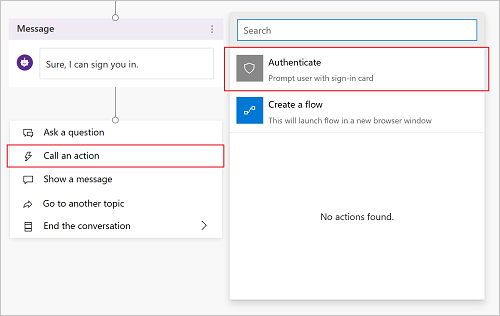
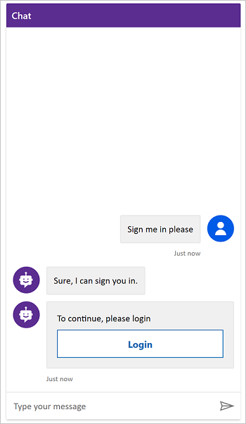

# Add end-user authentication to a Power Virtual Agents bot

You can enable user authentication directly within a Power Virtual Agents bot conversation. User authentication means you can prompt a user to sign in using single sign-on, retrieve a user token for that user, and then use that token to retrieve the user's information from a back-end system.


> [!IMPORTANT] 
> Before using this feature, you must follow the [end-user authentication configuration instructions](configuration-end-user-authentication.md).

## Prerequisites

- [!INCLUDE [Medical and emergency usage](includes/pva-usage-limitations.md)]


## Add user authentication to a topic

**Insert the authentication node template:**

1. Go to the [**Topics page**](authoring-create-edit-topics.md) for the bot you want to edit.

1. Open the **Authoring canvas** for the topic you want to add the authentication template to.

1. Select the plus (**+**) icon to add a message node. Enter what the bot should say to indicate that a sign-on experience is about to occur.

    

1. Underneath the message node, select the plus (**+**) icon, select **Call an action**, and then select **Authenticate**. 

    

1. Once selected, a number of new nodes will be added automatically. These nodes include a parent **Authenticate** node, followed by nodes for bot a success and a failure path. 

    
    
    >[!NOTE]
    >The **Authenticate** node is only available in the action picker at the end of a dialog tree (as a leaf node). It cannot be added in the middle of a dialog. Once added, other nodes can be added below it. 

### Authenticate node

The **Authenticate** node is where the user, if not already signed in, will be prompted with a sign-in card.




Once the user enters their username and password in the prompt (hosted by the identity provider), they might be prompted to enter a validation code, depending on the [channel](publication-fundamentals-publish-channels.md). Some channels, such as Microsoft Teams, do not require the user to enter a validation code.

The **Authenticate** node outputs two variables: `IsLoggedIn` and `AuthToken`. 

#### IsLoggedIn variable

The `IsLoggedIn` variable indicates whether the user is signed in (either as a result of signing in or already being signed in, also known as the log-in success path) or not signed in (which would result in the log-in failure path).

```IsLoggedIn``` is a boolean-type variable containing the signed-in status of the user. You can use this variable to create branching logic in your topics that checks for a successful sign-in (for example, in the template already provided as part of adding the **Authenticate** node), or to opportunistically fetch user information only if the user is signed in.

#### AuthToken variable

The ```AuthToken``` variable contains the user's token, obtained after the user is signed in. You can pass this variable to [Power Automate flows](how-to-flow.md) so they can connect to back-end APIs and fetch the user's information, or to take actions on the user's behalf.

> [!WARNING] 
> Make sure you're passing the `AuthToken` variable only to trusted sources. It contains user authentication information, which, if compromised, could harm the user.

Do not use `AuthToken` inside **Message** nodes, or on flows that you don't trust. 

## AuthToken usage without an Authenticate node

The ```IsLoggedIn``` and ```AuthToken``` variables are available even if you don't use the template provided by the **Call an action** menu entry. If you pass the `AuthToken` variable without first having the user go through the **Authenticate** node, the user will be prompted to sign in at that step. 

Passing the `AuthToken` variable can be useful if you always expect the user to be signed in, or if your user is being redirected from a different topic. We suggest you use the template provided by the **Call an action** entry to treat cases where the user fails to sign in.

> [!NOTE] 
> If the user signs out in the middle of a conversation, they will be prompted to sign in again if the topic comes to a node that uses the ```AuthToken``` variable.


### Success path

The success path equates to where ```IsLoggedIn = True``` and accounts for when the user has successfully signed in (or was already signed in). 

If you have logic that uses the `AuthToken` variable (for example, to connect to a back-end system using a flow to retrieve a user's information), it should go under this path.

### Failure path
The failure path equates to any condition other than `IsLoggedIn = True`. In most cases the failure path occurs because the user failed to sign in, used the wrong password, or canceled the sign-in experience.

Add any logic you might want to treat this case. As an example, we have provided options for retrying or to [escalate to a live agent](how-to-handoff.md). Customize the failure path's actions for your particular scenario and usage.


## Testing your topic

Make sure to [test your topic](getting-started-create-topics.md) using a real user configured in your identity provider. Ensure both the sign-in success and failure paths are exercised, so there are no surprises if your user fails to sign in or there is an error with the identity provider's sign-in experience.
