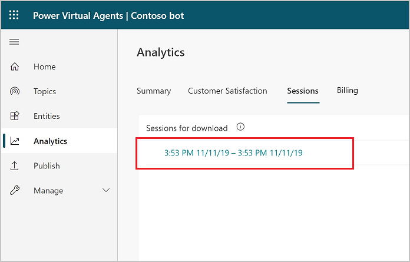
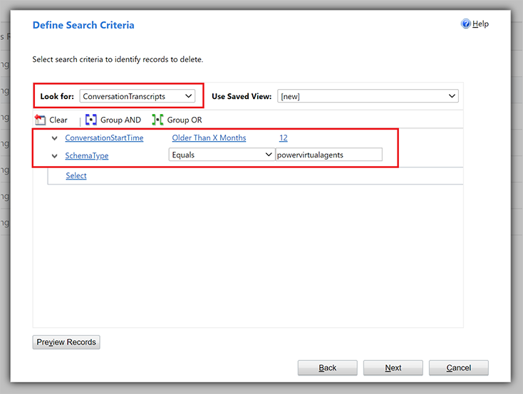

# Analyze session information in Power Virtual Agents

> [!div class="op_single_selector"]
> - [Power Virtual Agents web app](analytics-sessions.md)
> - [Power Virtual Agents app in Microsoft Teams](teams/analytics-sessions-teams.md)


By default, you can download up to seven days of bot conversation transcript sessions from the past 30 days directly from the Power Virtual Agents portal.

You can also download and view chat transcripts in the Power Apps portal.

See [Work with conversation transcripts](analytics-sessions-transcripts.md) for more details and tips.

Lastly, you can manage the retention period for transcripts. This can be useful if you want to increase the date range from 30 days to something else.

>[!NOTE]
>If you no longer have access to your environment, you'll need to [create a support request](https://admin.powerplatform.microsoft.com/support) in the Microsoft Power Platform admin center.

## Prerequisites

- [!INCLUDE [Medical and emergency usage](includes/pva-usage-limitations.md)]


## Download session transcript information from the Power Virtual Agents portal

1. Select **Analytics** on the side navigation pane. Go to the **Sessions** tab. 

    If your bot had a high number of sessions, they'll be broken down into multiple rows. Each row contains 2500 sessions. 

1. Click on each row to download the session transcripts for the specified timeframe.

    

The downloaded file contains the following information: 

- SessionID: A unique identifier per session. 

- StartDateTime: Time at which the session started. Entries are sorted by this column in descending order. 

- InitialUserMessage: First message typed by the user.

- TopicName: Name of the last authored topic that was triggered in this session. 

- ChatTranscript: Transcript of the session in the following format:
    - ***User says:**" "; **Bot says:**" ";* structure
    - Conversation turns are separated by semicolons
    - **Bot says** doesn't include the options presented to the user.
    
    Example: 
    ```
    User says: store hours; Bot says: Which store are you asking about?; User says: Bellevue; Bot says: Bellevue store is open from 10am to 7pm every day.;
    ```

- SessionOutcome: Outcome of the session (Resolved, Escalated, Abandoned, Unengaged).

- TopicId: A unique identifier of the last authored topic triggered in this session. 

>[!NOTE]
>The download will start when you select the time period. It will be downloaded into your default browser download's location.


## View and export bot conversation transcripts from the Power Apps portal

You can also view and export bot conversation transcripts from the Power Apps portal.

First, you'll need to sign in to [https://www.powerapps.com](https://www.powerapps.com) with your credentials.

### View conversation transcripts

1. In the side navigation pane, expand the **Data** node. Select **Entities**. On the top right, expand **Default** and select **All**.

    

1. Type **Conversation** in the **Search** textbox on the top right. Select **ConversationTranscript** under **Entities**.

    
 
1. Select **Data** tab. Expand **Active conversationtranscripts** and then select **All fields**.

    
 
1. View the bot's conversation transcripts.

    

### Export conversation transcripts

1. In the side navigation pane, expand the **Data** node. Select **Entities** and then **Export data**.

    

1. On the Export data screen, select **ConversationTranscript** from the entity list. Select **Export data** at the top. Your data will take a couple of minutes to be compiled for export.

    

1. Select **Download exported data** to download the content.

    
 
## Change the default period of session transcript retention

By default, a pre-configured bulk delete job will remove all conversation transcripts older than 30 days. 

To keep the transcripts for longer, you need to disable the existing system job and create a new job.

First, you'll need to sign in to [https://www.powerapps.com](https://www.powerapps.com) with your credentials.

The following instructions describe how to set a job to delete transcripts that are older than 12 months.

1. At the top right, open the **Settings** menu cog icon and select **Advanced settings**.

    
 
    This will take you to the Dynamics 365 portal.
 
    

2. Open the **Settings** menu and select **Data Management**.

    
 
3. Select **Bulk Record Deletion**.

    
 
4. On the **Bulk Record Deletion** screen, expand the **View** dropdown and select **Recurring Bulk Deletion System Jobs**.

    

5. Select the pre-configured bulk delete job called **Bulk Delete Conversation Transcript Records Older Than 1 Month**.

    
 
6. In the **More Actions** dropdown, select **Cancel** to disable future bulk deletion using this job.

    
 
7. Create a new bulk record delete job by selecting **New** and set the following:

    - Set **ConversationStartTime** as **Older Than X Months** to **12**.  
    This will keep the transcripts for 12 months

    - Set **SchemaType** as **equals** to **powervirtualagents**.

        
 
8. Enter a name and change **Run this job after every** to **1**.

    
 
    The bulk delete job is created and will delete bot conversation transcripts that are older than 12 months.

    
 


[!INCLUDE[footer-include](includes/footer-banner.md)]