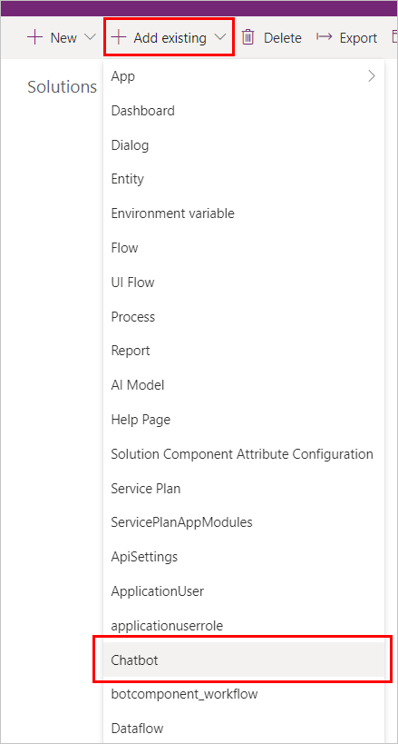
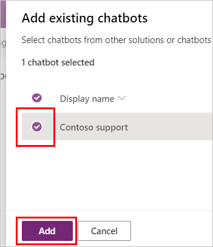
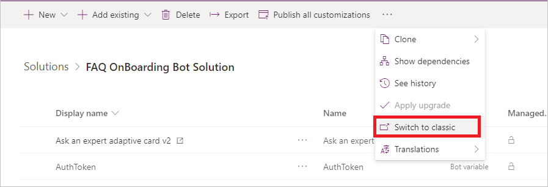
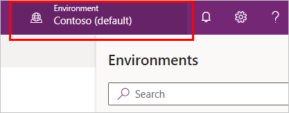
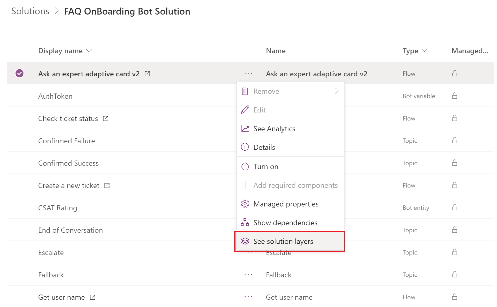

# Export and import bots using solutions

You can export and import bots using [solutions](/power-platform/alm/solution-concepts-alm) so you can move your bots across multiple [environments](/power-platform/admin/environments-overview).

This can be useful if you use different environments for different purposes, or you employ ring-deployment methodologies. For example, you might have a specific environment where you internally test and validate bots, another environment where you test bots for only a subset of users, and a final production environment where you share bots with customers and end users.

> 
> [!VIDEO https://www.microsoft.com/en-us/videoplayer/embed/RE4CsHl]
> 

## Prerequisites

- [!INCLUDE [Medical and emergency usage](includes/pva-usage-limitations.md)]

- A maker will require the minimum System Customizer security roles to use this feature. Learn more about [configuring user security to resources in an environment](/power-platform/admin/database-security).

## Add a bot to a solution

You use solutions to export bots from one environment and import them into another. The solution acts as a "carrier" for the bots, and you can import multiple bots in one solution.

**Create a solution to manage export and import**

1. Sign in to the Power Virtual Agents bot you want to export. 

1. Select **Settings**, and then select **General settings**.

    

2. Under **Export/import bot**, select **Go to Power Apps Solutions**.
 
    

3. Sign in to Power Apps and select **New solution**. Enter the information for each of the fields as described in this table, then select **Create**.

    

    Field | Description
    -- | --
    Display name | The name that is shown in the list of solutions. You can change this later.
    Name | The unique name of the solution. This is generated using the value you enter in the **Display name** field. You can edit this before you save the solution, but after you save the solution, you can’t change it.
    Publisher | You can select the default publisher or create a new publisher. We recommend that you create a publisher that you can use consistently across the environments where you'll use the solution. For more information, go to [Solution publisher overview](/powerapps/maker/common-data-service/change-solution-publisher-prefix).
    Version | Enter a number for the version of your solution. This is only important if you export your solution. The version number will be included in the file name when you export the solution.

**Add your bot to the solution**

1. Select the solution you want to add your bot to.

1. Select **Add existing** and choose **Chatbot**.

    

2. On the **Add existing chatbots** panel, select the bot (or bots) you want to export. Select **Add**.

    

3.  If you're using [skills](advanced-use-skills.md), remove the skill's environment variables **Current Value** by selecting **Remove from this solution**. 
     
     :::image type="content" source="media/EnvVariableRemoveCurrentValue.png" alt-text="Screenshot showing the Remove from this solution button.":::

> [!NOTE]
> Removing a bot from a solution doesn't remove its components from a solution. Removal of the components should be done separately.  

> [!WARNING]
> Do not remove any unmanaged chatbot subcomponents (such as bot topics) directly from the Power Apps portal, unless you have removed the bot itself from the solution.  
> 
> You should only make changes to topics from within the Power Virtual Agents portal.  
>
> Removing or changing the chatbot subcomponents from within Power Apps will cause the export and import to fail.

## Export and import bots

You export and import bots by exporting and importing their containing solutions from one environment to another.

**Export the solution with your bot**

1. In the list of solutions, select the solution that contains the bot you want to export. Select **Export**. 

    

    > [!NOTE]
    > You can't export managed solutions. When you create a solution, by default it will not be managed. If you change it to a managed solution you won't be able to export it, and will need to create a new solution.
    >
    > If your bot has a large number of components (for example, more than 250 topics or more than 100 entities), export the bot using classic Power Apps portal instead.
    >
    > 

2. Select **Next** in the **Before you export** panel.

4. The **Export this solution** panel appears. Enter or select from the following options, and then select **Export**:
    
    Option | Description
    - | -
    Version number | Power Virtual Agents automatically increments your solution version while displaying the current version. You can accept the default version or enter your own.
    Export as | Select the package type, either **Managed** or **Unmanaged**. Learn more about [managed and unmanaged solutions](/power-platform/alm/solution-concepts-alm#managed-and-unmanaged-solutions).

The export can take several minutes to complete. Once finished, a .zip file will be downloaded by your web browser. The file will be in the format `SolutionName_Version_ManagementType.zip`.

**Import the solution with your bot**

1. On the top menu, select the environment name and select the environment where you want to import your bot.

    

2. Go to the **Solutions** tab, and on the command bar, select **Import**.
 
    

1. In the **Select Solution Package** window, select **Choose File** and locate the .zip file that contains the solution with the bot you want to import.

1. Select **Next**.

1. Information about the solution is displayed. Select **Import**.

1. You might need to wait a few moments while the import completes. View the results and then select **Close**.

    If the import isn’t successful, you'll see a report showing any errors or warnings that were captured. Select **Download Log File** to capture details about what caused the import to fail in an XML file.  

      
    The most common cause for an import to fail is that the solution didn't contain some required components. For example, you might not have any upgraded bots in the environment.

1. If your bot has any of the following, you need to configure them after importing for the first time:
     
    - [End-user authentication](configuration-end-user-authentication.md): Configure end-user authentication in the bot so it can take actions on the user’s behalf. The bot can be set up with any [OAuth2 identity provider](/azure/active-directory/develop/v2-oauth2-auth-code-flow), such as Azure Active Directory (Azure AD), a Microsoft account, or Facebook.
    - [Customer service hand-off](advanced-hand-off.md): Configure external services that hand off bot escalations to a human agent.
    - Multichannel: Configure external channels, such as Facebook and Microsoft Teams:

        - [Microsoft Teams documentation](publication-add-bot-to-microsoft-teams.md)
        - [Facebook documentation](publication-add-bot-to-facebook.md)

1. Use the filter menu to select **Chatbot**. You can then select the bot's name to open the bot in the Power Virtual Agents portal. You can also navigate to the Power Virtual Agents web app directly and open the imported bot under the environment you imported to. You will also see the bot’s current solution name for easy access to solutions.  

    :::image type="content" source="media/BotPickerSolutionName.png" alt-text="List of bots and environments in Power Virtual Agents.":::

> [!IMPORTANT]
> You must [publish your newly imported bot](publication-fundamentals-publish-channels.md) before it can be shared.

## Upgrade or update a solution with a chatbot

If you add new bot components (such as new topics or flows) to your bot in the PVA portal, you will also need to update those changes to the bot in your target environment. You do this by adding the components to the unmanaged solution by selecting **Add required components** under the **...** menu next to the name of the bot.

There are times when you need to update an existing managed solution. To learn more, go to [Upgrade or update a solution](/powerapps/maker/common-data-service/update-solutions).

## Remove an unmanaged layer from a managed chatbot 
Managed and unmanaged solutions exist at different levels within a Microsoft Dataverse environment. To learn more, go to [Solution layers](/powerapps/maker/common-data-service/solution-layers).

A managed component (for example, a topic or flow) gets an unmanaged "Active" layer when you edit it, which means you won't see the latest changes after you deploy the solution. 
 
To show the latest updates, you'll need to remove the unmanaged "Active" layer. 
 
Use the **See solution layers** option to see all solutions that a component is a part of. You can also see one "Active" solution on top of all other solutions if you have changed something directly.

1. Select **See solution layers** from the contextual **...** menu next to the component name.

   

2. In the **Solution layer** page, select the unmanaged layer and then select **Remove unmanaged layer** to remove the layer. 

 
 

[!INCLUDE[footer-include](includes/footer-banner.md)]
