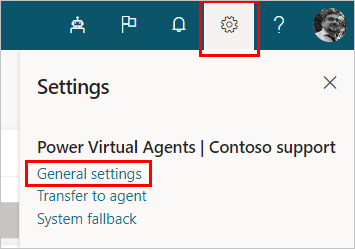
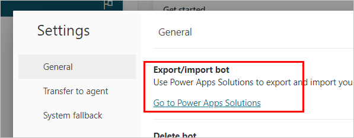
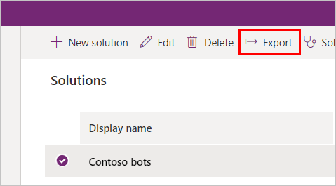

# Export and import bots using solutions (preview)

[!INCLUDE [cc-beta-prerelease-disclaimer](includes/cc-beta-prerelease-disclaimer.md)]

You can export and import bots using [solutions](/power-platform/alm/solution-concepts-alm) so you can move your bots across multiple [environments](https://docs.microsoft.com/power-platform/admin/environments-overview).

This can be useful if you use different environments for different purposes, or you employ ring-deployment methodologies. For example, you might have a specific environment where you internally test and validate bots, another environment where you test bots for only a subset of users, and a final production environment where you share bots with your customers and end users.

## Prerequisites

- [!INCLUDE [Medical and emergency usage](includes/pva-usage-limitations.md)]

- A maker will require minimum System Customizer security roles to use this feature. Learn more about [configuring user security to resources in an environment](https://docs.microsoft.com/power-platform/admin/database-security).

- You must have at least one bot already in the new or existing environments where you are importing to. This ensures you have the correct configuration in your environment when you import a bot.

> [!IMPORTANT]
> These features are in preview, which means that they are made available to you before general availability so you can test and evaluate them and provide feedback to Microsoft.  
>  
> Previews may employ reduced or different privacy, security, or compliance commitments than commercial versions. As such, previews are not meant to be used with any "live" or production Customer Data, Personal Data, or other data that is subject to heightened compliance requirements. Any use of "live" data is at your sole risk and it is your sole responsibility to notify your end users that they should not include sensitive information with their use of the Preview.  
>  
> These previews, and any support Microsoft may elect to provide, are provided "as-is," "with all faults," "as available," and without warranty.

## Upgrade existing bots (preview)
You will need to upgrade existing bots (built before June 2020) before you can export them. Newly created bots don’t require an upgrade, and won't show an option to upgrade them. 

**To update your existing bot**

1. Sign in to the Power Virtual Agents bot you want to upgrade. 

1. Select **Settings**, and then **General settings**.

    

2. Select **Upgrade bot**. This should take a few minutes.

    

>[!NOTE]
>A notice might appear that says "The upgrade is taking longer than expected. No action is required." If the notice does not disappear after 10 minutes, try refreshing your browser. You can continue working on your bot without losing any updates. 
>  
>If you still see the warning after a few days, create a support request with you Bot ID. Admins can use [Help + support](/power-platform/admin/get-help-support) in the Power Platform admin center to create a support request.  
>  
>

## Add a bot to a solution

You use solutions to export bots from one environment and import them into another. The solution acts as a "carrier" for the bots, and you can import multiple bots in one solution. You must have at least one bot in a solution to properly export and import it to another environment.

**Create a solution to manage import and export**

1. Select **Settings**, and then **General settings**.

2. Select **Go to Power Apps Solutions**.
 
    

3. Sign in to Power Apps and select **New solution**. Enter the information for each of the fields as described in this table, then select **Create**.

    

    Field | Description
    -- | --
    Display name | The name that is shown in the list of solutions. You can change this later.
    Name | The unique name of the solution. This is generated using the value you enter in the **Display name** field. You can edit this before you save the solution, but after you save the solution, you can’t change it.
    Publisher | You can select the default publisher or create a new publisher. We recommend that you create a publisher that you can use consistently across the environments where you'll use the solution. For more information, see [Solution publisher overview](/powerapps/maker/common-data-service/change-solution-publisher-prefix)
    Version | Enter a number for the version of your solution. This is only important if you export your solution. The version number will be included in the file name when you export the solution.

**Add your bot to the solution**

1. Select the solution you want to add your bot to.

1. Select **Add existing** and choose **Chatbot**.

    

2. On the **Add existing Chatbots** panel, select the bot (or bots) you want to export. Select **Add**.

    

3. On the filter on the top menu, select **Chatbot** to see the bot (or bots) you've added to the solution. Selecting the name of the bot will open it in the Power Virtual Agents portal.

3. If your bot doesn’t have [Skills](configuration-add-skills.md), you don't need to complete this step. 
    If your bot does have Skills, you need to add the respective environment variables in the solution. Each Skill has two environment variables: `AppID` and `manifestURL`.

    1. Select the solution you want to add your bot to.

    1. Select **Add existing** and choose **Environment variables**.
    1. On the **Add existing environment variables** panel and select the environment variables for your bot’s Skills. Each Skill has two environments variables. The environment variables **Display name** column will show the bot name in square brackets. For example, *[Bot name] Skill name*.

        
 
    1. Select the environment variables of the bot’s Skills. 
    1. Select **Next** to add them to the solution.

>[!NOTE]
>Removing a bot from a solution doesn't remove its components from a solution. Removal of the components should be done separately.  

>[!WARNING]
>Do not remove any unmanaged chatbot subcomponents (such as bot topics) directly from the Power Apps portal, unless you have removed the bot itself from the solution.  
>You should only make changes to topics from within the Power Virtual Agents portal.  
>Removing or changing the chatbot subcomponents from within Power Apps will cause the export and import to fail.

## Export and import bots

You export and import bots by exporting and importing their containing solutions from one environment to another.

**Export the solution with your bot**

1. In the list of solutions, select the solution that contains the bot you want to export. Select **Export**. 

    

    >[!NOTE]
    >You can't export managed solutions. When you create a solution, by default it will not be managed. If you change it to a managed solution you won't be able to export it, and will need to create a new solution.

2. Select **Next** in the **Before you export** panel.

4. The **Export this solution** panel appears. Enter or select from the following options, and then select **Export**:
    
    Option | Description
    - | -
    Version number | Power Virtual Agents automatically increments your solution version while displaying the current version. You can accept the default version or enter your own.
    Export as | Select the package type, either **Managed** or **Unmanaged**. Learn more about [managed and unmanaged solutions](/power-platform/alm/solution-concepts-alm#managed-and-unmanaged-solutions).

The export can take several minutes to complete. Once finished, a .zip file will be downloaded by your web browser. The file will be in the format `SolutionName_Version_ManagementType.zip`.

**Import the solution with your bot**

>[!NOTE]
>You must have at least one bot already in the new or existing environments where you are importing to. This ensures you have the correct configuration in your environment when you import a bot.

1. On the top menu, select the environment name and select the environment where you want to import your bot.

    

2. Go to the **Solutions** tab, and on the command bar, select **Import**.
 
    

1. In the **Select Solution Package** window, select **Choose File** and locate the .zip file that contains the solution with the bot you want to import.

1. Select **Next**.

1. Information about the solution is displayed. Select **Import**.

1. You may need to wait a few moments while the import completes. View the results and then select **Close**.

    If the import isn’t successful, you'll see a report showing any errors or warnings that were captured. Select **Download Log File** to capture details about what caused the import to fail in an XML file  
      
    The most common cause for an import to fail is that the solution didn't contain some required components. For example, you may not have any upgraded bots in the environment.

1. After import, open the imported solution. Use the filter menu on the top menu to select **Environment variable**. Enter the values as described in the section **Add your bot to the solution**.

1. If your bot has any of the following, you need to configure them after importing first time:

    - [Power Automate flows](/power-automate/import-flow-solution): Configure any flow connections for the first time. You don't need to reconfigure the flow connections for subsequent imports of the bot when updating the flow.  
      If you import a solution containing a bot that leverages Power Automate, and any new Flows are included in that import operation, you'll need to visit the Power Virtual Agents portal and select the bot. 
    - [Skills](advanced-use-skills.md): Add the values for the Skills’ environment variables.
    - [End-user authentication](configuration-end-user-authentication.md): Configure end-user authentication in the bot so it can take actions on the user’s behalf. The bot can be set up with any [OAuth2 identity provider](/azure/active-directory/develop/v2-oauth2-auth-code-flow), such as Azure Active Directory (Azure AD), a Microsoft account, or Facebook.
    - [Customer service hand-off](advanced-hand-off.md): Configure external services that hand-off bot escalations to a human agent.
    - Multi-channel: – Configure external channels, such as Facebook, and internal non-Power Virtual Agents services, such as Microsoft Teams:

        - [Facebook documentation](publication-add-bot-to-facebook.md)
        - [Microsoft Teams documentation](publication-add-bot-to-microsoft-teams.md)

1. Use the filter menu to select **Chatbot**. You can then click on the bot's name to open the bot in the Power Virtual Agents portal. You can also navigate to the portal directly and open the imported bot under the environment you imported to.

    

## Upgrade or update a solution with a chatbot

If you add new bot components (such as new topics or flows) to your bot in the PVA portal, you will also need to update those changes to the bot in your target environment. You do this by adding the components to the unmanaged solution by selecting **Add required components** under the *...* menu next to the name of the solution, and then choosing the new components before you export it.

There are times when you need to update an existing managed solution. To learn more, go to [Upgrade or update a solution](/powerapps/maker/common-data-service/update-solutions).

## Remove an unmanaged layer from a managed chatbot 
Managed and unmanaged solutions exist at different levels within a Common Data Service environment. To learn more, go to [Solution layers](/powerapps/maker/common-data-service/solution-layers).

 
