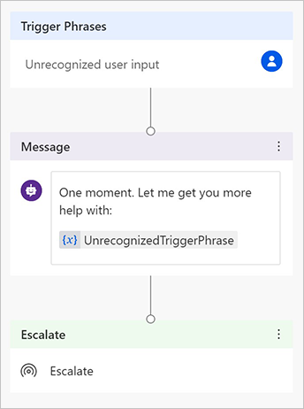

# Configure the system fallback topic in Power Virtual Agents

Select the version of Power Virtual Agents you're using here:

> [!div class="op_single_selector"]
> - [Power Virtual Agents web app](authoring-system-fallback-topic.md)
> - [Power Virtual Agents app in Microsoft Teams](teams/authoring-system-fallback-topic-teams.md)

During a conversation, a Power Virtual Agents bot [triggers the appropriate topic based on the user's input](authoring-create-edit-topics.md). If the bot can't determine the user's intent, it prompts the user again. After two prompts, the bot escalates to a live agent through the system **Escalate** topic.

In some scenarios, you might want to customize how the bot behaves when user input doesn't trigger any topic. For example, you can build a catchall topic to capture unrecognized user intent, or use a topic to call back-end systems or route to existing services.

You customize these fallback behaviors by adding the system **Fallback** topic. You can also customize the **Fallback** topic, similar to most other system topics.

## Prerequisites

- [!INCLUDE [Medical and emergency usage](includes/pva-usage-limitations.md)]

## Add a system fallback topic

1. On the top navigation pane, select **Settings** , and then go to the **System fallback** tab.

2. Select **"+Add"**.

  
 
A system fallback topic is added. The bot will go to this topic when it can't find an appropriate topic or doesn't understand the user's input. 

A new option will appear on the **Settings** pane under the **System fallback** section: **Go to fallback topic**, which lets you customize the topic.
 
## Customize the system fallback topic

After you add the system fallback topic, you can open it by selecting **Go to fallback topic** on the **Settings** pane. 

You'll also see the **Fallback** topic listed under **System Topics** in the topic list. 

When you open this topic in the authoring canvas, you'll see that the default fallback topic contains two nodes: a **Message** node that rephrases the user input and an **Escalate** node that redirects to a live agent. 

 
You can customize this topic as with any other [system topic](authoring-create-edit-topics.md). You can also use the *UnrecognizedTriggerPhrase* variable that stores the user input the bot couldn't understand. For example, you can use the variable as an input and pass it to a [Power Automate flow](advanced-flow.md) or [Bot Framework Skill](advanced-use-skills.md).

>[!Note]
>The system fallback topic doesn't have a trigger phrase.

## Reset system fallback behavior by deleting the fallback topic

To reset the system fallback behavior and return it to its default behavior, go to **Settings** and then **System Fallback**. In the **System fallback** section, select **Delete** to remove the fallback topic. 

 
>[!WARNING]
>This will remove the fallback topic and any changes you made to it. 

