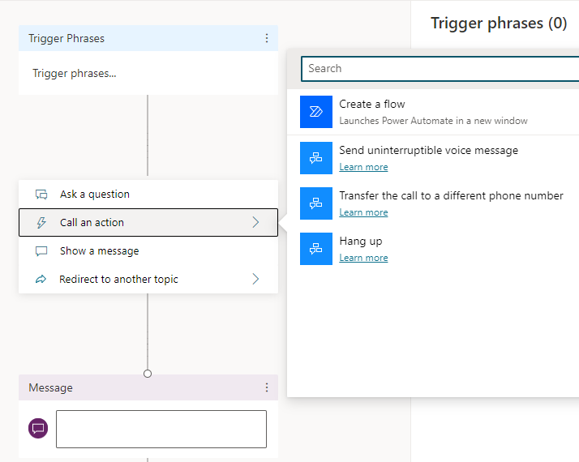
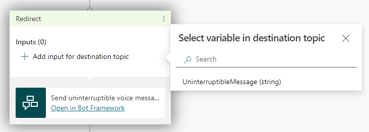
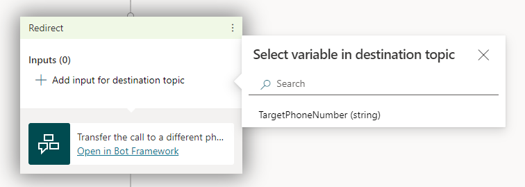

# Configure seamless and contextual hand-off to Omnichannel for Customer Service

[!INCLUDE [cc-beta-prerelease-disclaimer](includes/cc-beta-prerelease-disclaimer.md)]

With Power Virtual Agents, you can seamlessly and contextually hand off escalated Power Virtual Agents conversations to live (human) agents using [Omnichannel for Dynamics 365 Customer Service](/dynamics365/omnichannel/omnichannel-customer-service-guide). 

>[!IMPORTANT]
>This is a preview feature.
>Preview features aren't meant for production use and may have restricted functionality. These features are available before an official release so that customers can get early access and [provide feedback](https://powerusers.microsoft.com/t5/Forums/ct-p/pva_forums).

When you hand off a conversation, you share the full history of the conversation (the context) as well as all user-defined variables. This allows Omnichannel for Customer Service to route incoming escalations to the right live agent queue and enables engaging live agents to review context from the prior conversation and resume the conversation.

To add hand off capabilities to your bot, you install the associated extension solutions to enable text- and voice-based hand off capabilities, and then connect your Omnichannel instance to your Power Virtual Agents bot.

For more information about hand off, and how to use hand-off within a bot conversation, see the [Using Transfer to agent node](./advanced-hand-off.md) topic.

>[!NOTE]
>If you'd previously configured a bot to hand off to Omnichannel (before November 2021), the **Omnichannel** tile's settings will appear as if they have not been configured. This is a known issue, and has no effect on the bot or the existing Omnichannel connection, which will continue to run normally.  
>  
>You can force the settings display to refresh and show the actual connection details by selecting **Enable**.
>  
>If you want to add voice-based capabilities for hand off to your already-connected bot, you must disconnect and reconnect the bot from Omnichannel.

## Prerequisites
* Environments:
  * You must install the [extension solutions](#install-extension-solutions) in the same environment where you have your bots.
  - Your bot (and extension solutions) environment and Omnichannel environment must be in the same [geographical region](data-location.md#data-locations).
  - For voice-based hand off capabilities, your environments must be hosted in a datacenter within the [United States Azure geographic location](data-location.md#data-locations).
* You need a [product license for Power Virtual Agents](https://go.microsoft.com/fwlink/?LinkId=2092080&clcid=0x409) and a [product license for Omnichannel for Customer service](/dynamics365/customer-engagement/omnichannel/try-chat-for-dynamics365).
* You must be [assigned the Omnichannel administrator role](/dynamics365/omnichannel/administrator/add-users-assign-roles#understand-roles-and-their-privileges) to add bots in Omnichannel.
* You'll need an [application registered in Azure](/azure/active-directory/develop/howto-create-service-principal-portal#create-an-azure-active-directory-application) before you can connect to Omnichannel.
* [!INCLUDE [Medical and emergency usage](includes/pva-usage-limitations.md)]

>[!IMPORTANT]
>Your bot must be in a published state for end-to-end capabilities to work as expected. Ensure that you have [published your bot](./publication-fundamentals-publish-channels.md) prior to validating the integrated experience.  
>  
>If you want to test the bot on your custom website, you must use the embed code that is specified in the chat widget you set up in Omnichannel (see **Prerequisites** in the [Integrate a Power Virtual Agents bot](/dynamics365/omnichannel/administrator/configure-bot-virtual-agent#prerequisites) article). If you use the embed code from the Power Virtual Agents site, hand-off will not occur correctly.

## Install extension solutions

For your bot to hand off a conversation to Omnichannel, you have to install the appropriate extension solutions for Omnichannel and Power Virtual Agents:

- If you only want text-based (messaging) hand off capabilities, you must install the following extension:
    - [Omnichannel Power Virtual Agents Extension](https://appsource.microsoft.com/product/dynamics-365/mscrm.omnichannelpvaextension)

- If you want both text-based (messaging) and voice-based hand off capabilities, you must install each of the following extensions in the following order:

    1. [Power Virtual Agents telephony extension](https://appsource.microsoft.com/product/dynamics-crm/mscrm.mspva_telephony_extension)
    1. [Omnichannel Power Virtual Agents extension](https://appsource.microsoft.com/product/dynamics-365/mscrm.omnichannelpvaextension)
    1. [Omnichannel voice Power Virtual Agents extension](https://appsource.microsoft.com/product/dynamics-365/mscrm.omnichannelvoicepvaextension)

>[!IMPORTANT]
>You must install the [Omnichannel Power Virtual Agents Extension](https://appsource.microsoft.com/product/dynamics-365/mscrm.omnichannelpvaextension) for all Omnichannel hand off scenarios.  
>  
>If you only want to use voice capabilities, you must still install this extension.

## Connect Omnichannel to your Power Virtual Agents bot

Sign in to the Power Virtual Agents bot you want to connect to Omnichannel for Customer Service.

1. On the side navigation pane, expand the **Manage** tab, go to **Agent transfers**, and then select the **Omnichannel** tile.
    
    :::image type="content" source="media/handoff-settings.png" alt-text="IMAGE-SHOWING-SETTINGS-PANEL-OPENED.":::

1. Select **Enable**.

    >[!NOTE]
    >If you haven't installed any of the [extension solutions required for hand off](#install-extension-solutions), you'll see a notification that your bot doesn't have access to the variables or actions needed for hand off to Omnichannel.  
    >  
    >You must [install at least the Omnichannel extension solution](#install-extension-solutions) for hand off to Omnichannel to work.  
    >  
    >

1. Under **See the environment this bot is connected to**, select the environment where your Omnichannel instance is provisioned.

    >[!IMPORTANT]
    >You'll see a message if you haven't set up Omnichannel in the environment you select here.  
    >  
    >You might also see this message if you're using a [managed bot](authoring-export-import-bots.md). If the managed bot has Omnichannel enabled, the message will disappear after your next import. If the bot doesn't have Omnichannel enabled, the message will continue to show.
    >  
    >:::image type="content" source="media/transfer-no-oc.png" alt-text="Message that says you haven't set up Omnichannel in this environment.":::

1. Follow the steps to create or reuse an existing Azure application ID. Copy the *Application (client) ID* and paste it in the text box provided.

    >[!IMPORTANT]
    >Omnichannel models bots as "application users" in the system. Therefore, the *Application (client) ID* that you use must be unique to your organization (your Microsoft Dataverse organization or environment).

1. Power Virtual Agents uses a [Teams channel](./publication-fundamentals-publish-channels.md) to communicate with Omnichannel for Customer Service. If a Teams channel is not enabled, a Teams channel will be enabled when you select **Next**. 

1. Select the **Go to Omnichannel** link to [continue configuring the bot connection in Omnichannel for Customer Service](/dynamics365/omnichannel/administrator/configure-bot-virtual-agent).

After you've configured the connection, you'll see your bot in the **Omnichannel** tile under **Agent transfers**. From here, you can disconnect the bot, refresh the connection, or view the connection details in Omnichannel.

You can also toggle voice capabilities on or off.

### Disconnect your bot from Omnichannel or disable the Omnichannel connection

If you select **Disconnect bot**, the application user that represents the bot in Omnichannel will be disabled, which effectively disconnects the bot from the specified Omnichannel environment. 

To add your bot back, you'll need to connect it again, as described in the section [Connect Omnichannel to your Power Virtual Agents bot](#connect-omnichannel-to-your-power-virtual-agents-bot) (starting at Step 3).

If you select **Disable**, the connection between your Omnichannel instance and Power Virtual Agents will be disabled, and your bot will stop receiving any traffic from Omnichannel.

### Refresh the connection

If you select **Refresh**, the connection between your bot and Omnichannel will be checked. This is useful after you add your bot to a workstream in Omnichannel so you can check that the connection has been successfully completed.

### Toggle voice capabilities

You can enable voice-based hand off capabilities by switching the **Enable voice** toggle. This applies to the entire bot, not for individual bot sessions or connections.

When voice is enabled, any connection with the bot can use voice, text, or both.

If you previously had connected a bot to Omnichannel (before November 2021), and want to enable voice-based capabilities, you must [disconnect and reconnect the bot to Omnichannel](#disconnect-your-bot-from-omnichannel-or-disable-the-omnichannel-connection).

Authentication is not supported for voice-based hand off to Omnichannel. If you've set up authentication for the bot, the [authentication variables](advanced-end-user-authentication.md) will not contain authentication information in them when sent to Omnichannel.

>[!WARNING]
>For voice-based hand off capabilities, your bot and Omnichannel environments must be hosted in a datacenter within the [United States Azure geographic location](data-location.md#data-locations).
>  
>If the environment (on environments) you use for your bot or Omnichannel instance aren't in the US region, voice capabilities will not work and there will be no error messages or warnings.

## Voice-based hand off capabilities

The [Power Virtual Agents telephony extension](https://appsource.microsoft.com/product/dynamics-crm/mscrm.mspva_telephony_extension) adds a number of additional actions and variables to Power Virtual Agents that can be used by bots during hand off to Omnichannel.

### Send uninterruptible voice message

This action can be used to send messages which can't be interrupted by the caller. 

1. Add this action as you would [any other action when adding nodes](authoring-create-edit-topics.md#insert-nodes). 

1. Select **Add input for destination topic** and then **UninterruptibleMessage (string)**.

    

3. Select an existing variable that defines the message content, or directly enter the message that should be used.

    

### Transfer the call to a different phone number
This action can be used to transfer the call to a different phone number altogether. 

1. Add this action as you would [any other action when adding nodes](authoring-create-edit-topics.md#insert-nodes).
2. Select **Add input for destination topic** and then **TargetPhoneNumber (string)**.
    
3. Select an existing variable that defines the number that should be called instead, or directly enter the number.

>[!NOTE]
>This action requires the "Make calls" privilege when purchasing the phone number. Without this privilege, the transfer will fail.

### Hang up
This action can be used to hang up the call. Once the conversation reaches this action, the call will be dropped.

1. Add this action as you would [any other action when adding nodes](authoring-create-edit-topics.md#insert-nodes). 

    

### *bot.CustomerPhoneNumber* variable

This variable contains the phone number of the customer who called the bot. This is also known as CallerID. 
You can also use the "Is Empty" condition in the authoring experience to check if the conversation is from a caller on a phone (which will always return *False*), or from messaging  (will always return *True*).

### *bot.OrganizationPhoneNumber* variable
This variable contains the phone number the customer dialed to reach the bot.

### Authoring considerations

- When using adaptive cards, ensure you are using them through [Composer integration](advanced-bot-framework-composer.md) so their "speak" property is correctly read by the voice bot.
- When using markdown on topics, the voice bot will read the asterisk mark *.  
    Adjust your markdown accordingly and always test your bot using voice to ensure the desired result.

## Known limitations
See [limitations when using Power Virtual Agents with Omnichannel for Customer Service](/dynamics365/omnichannel/administrator/configure-bot-virtual-agent#limitations) for more information.

[!INCLUDE[footer-include](includes/footer-banner.md)]

