# Quickstart: Create and deploy a Power Virtual Agents bot online

Select the version of Power Virtual Agents you're using here:

> [!div class="op_single_selector"]
> - [Power Virtual Agents web app](fundamentals-get-started.md)
> - [Power Virtual Agents app in Microsoft Teams](teams/fundamentals-get-started-teams.md)

Power Virtual Agents empowers teams to quickly and easily create powerful bots using a guided no-code graphical experience - all without the need for data scientists or developers. 

This quickstart guide takes you through the end-to-end experience of creating a bot for the first time, adding topics to your bot, testing content changes in real time, deploying your bot to a test page, and analyzing the performance of your bot after it's been deployed. 

> 
> [!VIDEO https://www.microsoft.com/videoplayer/embed/RE4mLcX ]
>

In addition to this guide, you can also [download and use templates to help you create, develop, and publish chatbots with Power Virtual Agents](fundamentals-templates.md).

## Prerequisites

- [!INCLUDE [Medical and emergency usage](includes/pva-usage-limitations.md)]

## Create your first bot

1. Go to [Power Virtual Agents website](https://aka.ms/TryPVA) in your browser to begin. Supported browsers include Microsoft Edge, Chrome, and Firefox. On the website, select **Start free**, and then sign in with your work email address. Note that personal Microsoft accounts aren't currently supported.

    

2. Next, you'll choose a name for your bot. This can be something generic to your company or specific to the scenario you are tailoring your bot to.

    Your bot is created in the default Power Apps environment that was created for you when you signed up. For most users, this is sufficient. However, if you want to specify a custom Power Apps environment for your Power Virtual Agents, you can do so by expanding the **More options** menu and selecting a different environment.

   > [!NOTE] 
   > Power Virtual Agents is supported only in the locations listed in the [supported data locations](data-location.md) topic, with data stored in respective data centers. If your company is located outside of the supported data locations, you need to create a custom environment with **Region** set to a supported data location before you can create your bot. For more information on how to create a custom Power Apps environment, see [Working with environments](environments-first-run-experience.md).

   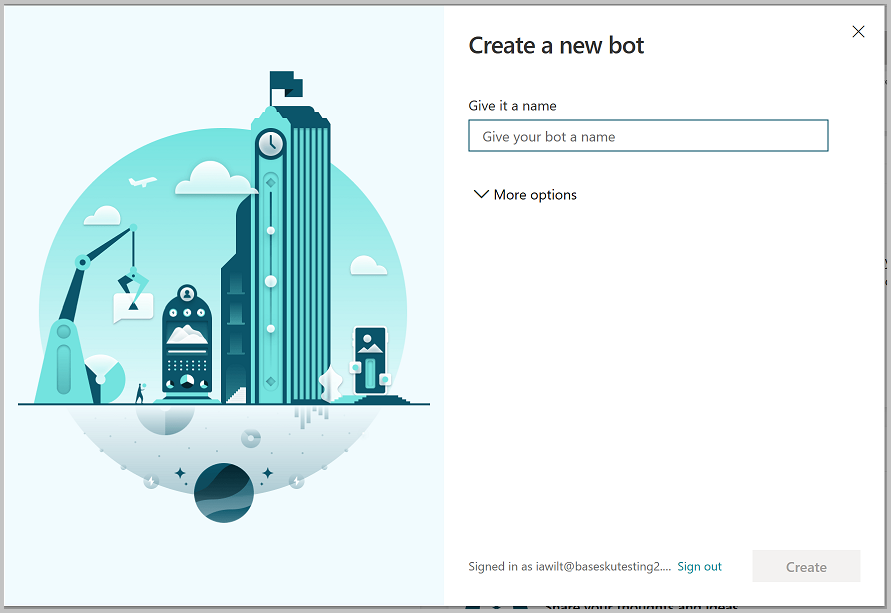
   

3. Once you select **Create**, the process of creating the first bot within a new environment can take up to 15 minutes. Subsequent bots will be created much faster. 

4. After a few minutes, you'll land on the home page and have an opportunity to play around with the bot in read-only mode. You can't save any edits during this time, but you can explore the overall user interface, look at the topics, experiment with the preloaded User Topics and System Topics, and interact with your bot using the Test Canvas. During this time, you can review additional documentation on authoring topics in your bot. See [Authoring key concepts](authoring-fundamentals.md).
   

5. When the bot creation process completes, the banner changes. You now have full functionality in the bot and can modify any User or System topic, test out your content changes, or deploy your bot.

## Create a topic

1. Now that you have full functionality within your bot, you can create your own topic—or, in other words, a dialog tree specifying how your bot responds to a user's question.

2. Start by selecting **Topics** in the side navigation pane, and then select **New topic** at the top of the page.

    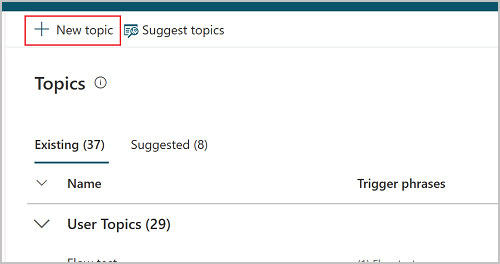
    

3. You can now name your topic and include some trigger phrases for this topic. Trigger phrases are examples of the type of user questions or utterances that help teach the bot when to respond with this dialog. 
    

   As an example, let's create a topic called 'Personal Hello World' and add 'hello world' as a trigger phrase. Select **Save topic** to add the topic to the topics list.
    
    

4. After saving your topic, select **Go to authoring canvas**. This is the graphical dialog tree editor that allows you to define bot responses and the overall bot conversation.

   Start by entering 'Hello! I'll create a personalized greeting for you.' into the first **Message** node. 
   
    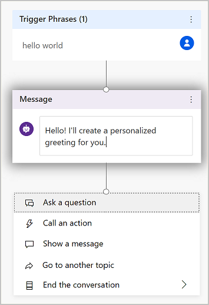
    

    

5. Then, click on the **+** below the node, and add an **Ask a question** node by selecting it in the menu. Enter the question text, 'Where do you live?', in the **Ask a question** box. To give the customer a choice between different responses, select **Multiple choice options** under **Identify**.
    
    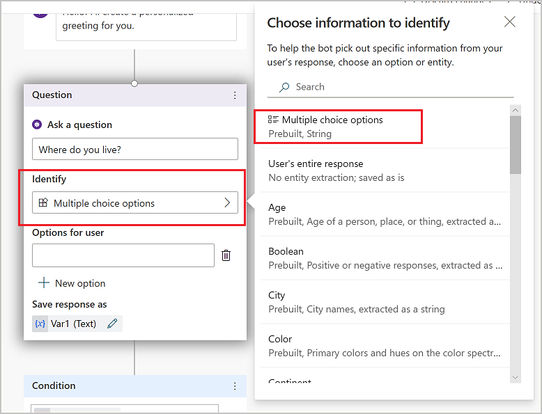

6. Add two options for the user, by selecting **+ New option**. Enter 'Seattle' and 'Bellevue' in the text boxes called 'Options for user'. Each option is presented as a multiple choice button to the user.

    The authoring canvas creates separate paths in the conversation, depending on the customer's response. The conversation path leads the customer to the appropriate resolution for each user response.

    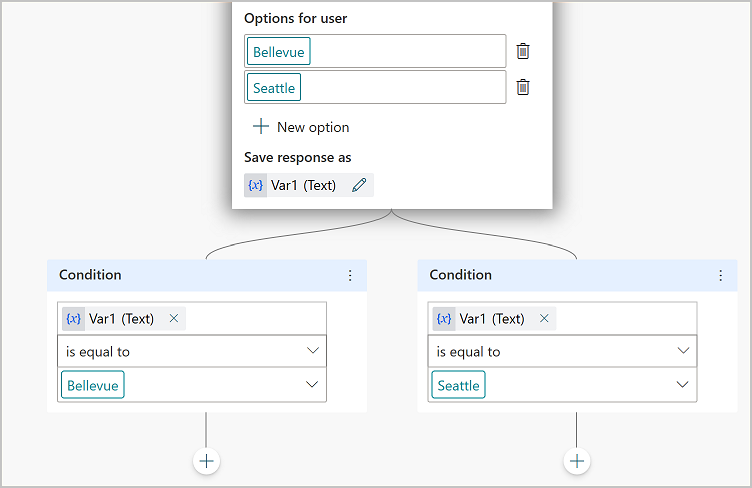

7. In the forked conversation path, each node has automatically checked for 'Seattle' in one path, and 'Bellevue' in the other path to take the appropriate next step.

8. Finally, click the **+** below each of the Condition nodes to add a **Message** node in each branch. Add a simple message like 'Hello Seattle!' in the Seattle branch, and 'Hello Bellevue!' in the Bellevue branch. Select **Save** at the top.

    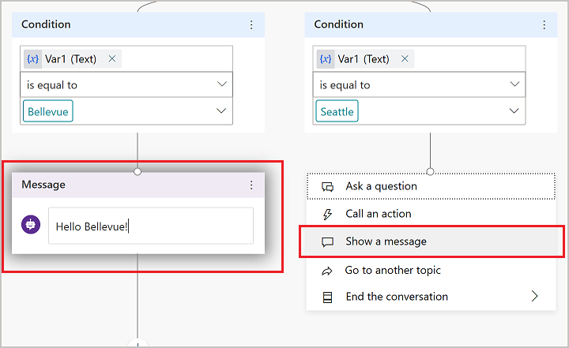
    

You now have a very simple branching dialog tree, congratulations! You can begin to create more complex versions of this tree by incorporating [variables](authoring-variables.md), [entities](advanced-entities-slot-filling.md), and [Power Automate flows](advanced-flow.md).

 
## Test your content in real time

1. Now that you have some content authored into a dialog tree, it's time to test this out in real time to see if it's working as you expected. For this, you'll use the test bot panel.

    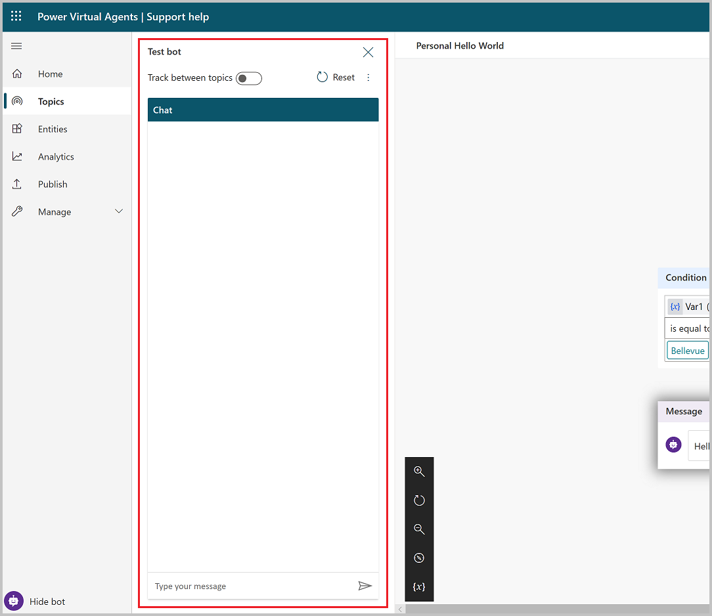
    
      
      
    If the test bot is not showing on your screen, select **Test your bot** at the bottom of the side navigation pane.

    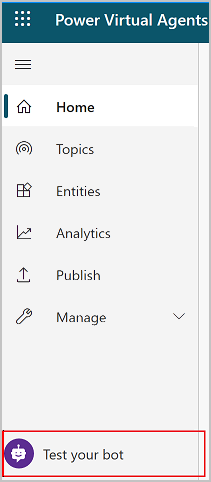

  
2. You can try out your newly authored dialog tree by typing into the test bot window. Turn on **Track between topics** at the top, which enables you to follow along with the bot as it executes your dialog. You'll start to see parts of your dialog tree highlighted as the bot gets to that portion of the dialog.

    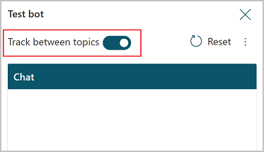
   

3. Type "hello world" in the chat window, and send the message to the bot. You'll see the top portion of your dialog tree highlighted in green, and you'll see **Seattle** and **Bellevue** presented as user options in the test bot window.
The bot is now waiting for you to respond and has provided suggestions on how to respond. These suggestion buttons reflect what you authored within your dialog tree in the 'Ask a question' node. In the test bot, you can either select these suggestion buttons to continue, or you can enter your response into the chat window. 

    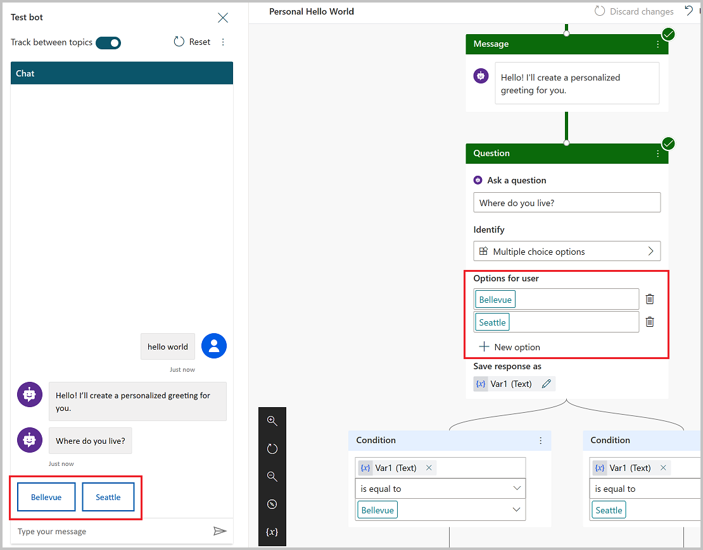
    
  

4. You can continue the dialog by selecting the Seattle branch. You'll see the chat stop once you've reached the bottom of this branch. If you author more content, the dialog will continue, but since we've only created a very simple and small dialog tree, we can reach the end of the content very quickly.

    This test experience empowers you to quickly create and test a conversation to ensure that the conversation will flow as anticipated. If the dialog does not reflect your intention, you can change the dialog, and save it. The latest content will be pushed into the test bot, and you can try it out again. None of this changes the published version of the bot, so feel free to play around with your content until you are happy with it.
 

## Publish your bot

1. Once you are fine with the content authored in your bot, you can publish your bot to a website. Start by selecting the **Publish** tab in the side navigation pane.

    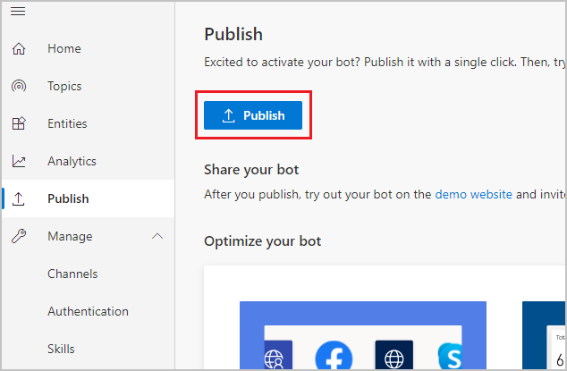
    
 
2. Select **Publish** to activate your bot with a single click. If the publish is successful, a green banner on the top of the page will indicate so.

 
3. Then click on the demo website link under **Share your bot** to see it in action on a demo website. A new window opens in your browser. If this doesn't happen automatically, check whether a pop-up blocker has been activated and, if so, allow the window to be opened. Usually, you can allow pop-ups from the URL field directly. This is a webpage that demonstrates what your bot looks like to an end-user who comes to your webpage. The bot canvas is at the bottom. You can interact with it by typing into the window or by selecting a starter phrase from the provided options. This is your bot in action. 

    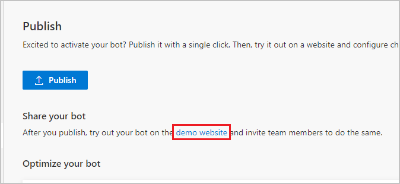
    

For more information on publishing your bot to other channels, see the documentation under [Publication key concepts](publication-fundamentals-publish-channels.md). 

## Analyze the performance of your bot

1. Once your bot has completed interactions with users, the statistics are available on the **Analytics** tab in the side navigation pane. Here, you can find key performance indicators (KPIs) showing the volume of sessions your bot has handled, how effectively your bot was able to engage end-users and resolve issues, escalation rates to human agents, and abandonment rates during conversations. You will also find customer satisfaction information at the KPI level as well as in the **Customer Satisfaction** tab.

    > [!NOTE]
    > There is up to a 1-hour delay between when the conversations occur and when the statistics for those conversations appear in the analytics views. Also, all interactions with the bot are logged in analytics, including interactions from your demo website, custom website, or test bot.

2. You can also view detailed session history and transcripts by selecting **Sessions** from the **Analytics** tab. This enables you to download a CSV file with the full session transcript. This can be a helpful way for you to tune the performance of your bot and change the content in your topics to improve your bot's efficiency.

    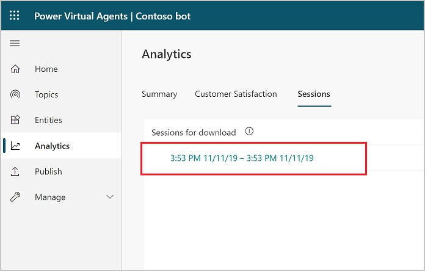
    

    For more information, see [Analytics key concepts](analytics-overview.md).
    
## Conclusion

You've now created a bot, created your own topic, tested it out, published it to a demo website, and learned how to analyze your bot's performance. Congratulations! Your bot has many capabilities beyond this, so please try it out and play with the advanced features.

For questions not covered in the product documentation or for feature ideas, please [visit our community](https://aka.ms/PowerVirtualAgentsForum) and post questions.

We would also like to hear your ideas on Power Virtual Agents. Please [visit our Ideas board](https://aka.ms/PowerVirtualAgentsIdeas) and post your ideas.

[!INCLUDE[footer-include](includes/footer-banner.md)]
