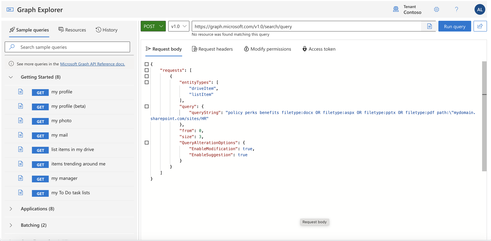
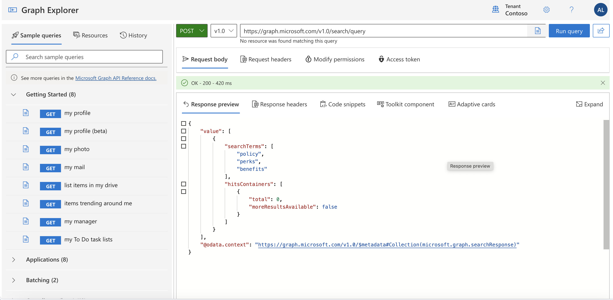
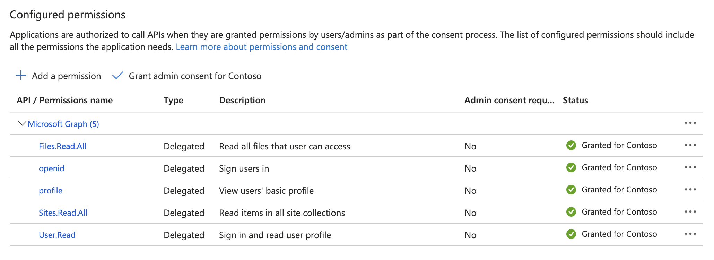
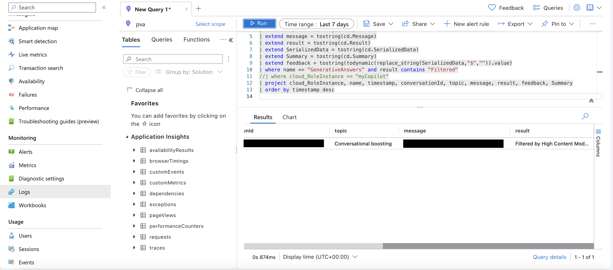

title: "No response from Create generative answers over SharePoint"
description: "Troubleshoot Generative Answers over SharePoint or OneDrive when no response is returned"
author: adilei
ms.date: 03/11/2024
ms.topic: conceptual
ms.custom: guidance
ms.author: adileibowitz
ms.reviewer: 
---

# No answers are returned from Conversational Boosting/Generative Answers over SharePoint or OneDrive

Conversational boosting allows makers to create copilots that respond to questions grounded in data sources like public websites or SharePoint, simply pointing the copilot at those data sources. However, in some cases, the copilot will not provide a response and instead say something like **“I’m not sure how to help with that. Can you try rephrasing?”** (the actual message will depend on the implementation).


## Why doesn't my "Create generative answers" node respond? 

There could be several different factors preventing Generative Answers from returning a response, when a SharePoint or OneDrive data source is configured:

1. [Search results are missing](#search-results-are-missing)
2. [The user accessing the copilot does not have sufficient permissions on the data source](#missing-user-permissions)
3. [Files are larger than the 3MB size limitation](#file-size-limitation)
4. [The app registration or the copilot are misconfigured](#the-app-registration-or-copilot-are-misconfigured)
5. [Content has been blocked by content moderation](#content-has-been-blocked-by-content-moderation)

Before reading further, please make sure you have followed the instructions on how to [set up Generative Answers over SharePoint or OneDrive](../nlu-boost-node.md).

## Search results are missing

Generative Answers for SharePoint or OneDrive data source relies on making calls to the Graph API search endpoint. Only the 3 top results coming back from Graph API are being used to summarize and generate a response, so if no results come back from Graph API, the Generative Answers node will not provide a response.

To understand whether in your case Copilot Studio is not getting results back from Graph API, it is possible to make direct calls to the Graph API search endpoint, which will closely simulate the way Copilot Studio works behind the scenes. Calls to the Graph API search endpoint can be generated by using the template below with [Graph Explorer](https://learn.microsoft.com/en-us/graph/graph-explorer/graph-explorer-overview). When accessing the Graph Explorer, be sure to sign-in using the appropriate credentials for the SharePoint/OneDrive tenant.

The template can be used either by copying the payload below, or using this [deep link](https://developer.microsoft.com/en-us/graph/graph-explorer?request=search%2Fquery&method=POST&version=v1.0&GraphUrl=https://graph.microsoft.com&requestBody=eyJyZXF1ZXN0cyI6W3siZW50aXR5VHlwZXMiOlsiZHJpdmVJdGVtIiwibGlzdEl0ZW0iXSwicXVlcnkiOnsicXVlcnlTdHJpbmciOiJTRUFSQ0ggVEVSTVMgZmlsZXR5cGU6ZG9jeCBPUiBmaWxldHlwZTphc3B4IE9SIGZpbGV0eXBlOnBwdHggT1IgZmlsZXR5cGU6cGRmIHBhdGg6XCJET01BSU4uc2hhcmVwb2ludC5jb20vc2l0ZXMvU0lURU5BTUUifSwiZnJvbSI6MCwic2l6ZSI6MywiUXVlcnlBbHRlcmF0aW9uT3B0aW9ucyI6eyJFbmFibGVNb2RpZmljYXRpb24iOnRydWUsIkVuYWJsZVN1Z2dlc3Rpb24iOnRydWV9fV19) which will open Graph Explorer with a pre-populated query.

**POST https://graph.microsoft.com/v1.0/search/query**

```json
{
    "requests": [
        {
            "entityTypes": [
                "driveItem",
                "listItem"
            ],
            "query": {
                "queryString": "SEARCH TERMS filetype:docx OR filetype:aspx OR filetype:pptx OR filetype:pdf path:\"DOMAIN.sharepoint.com/sites/SITENAME"
            },
            "from": 0,
            "size": 3,
            "QueryAlterationOptions": {
                "EnableModification": true,
                "EnableSuggestion": true
            }
        }
    ]
}
```

### Missing results

For example, let’s assume that Generative Answers is configured to provide responses based on content stored in: https://mydomain.sharepoint.com/sites/HR, but users are not getting responses when asking “What is our policy regarding perks & benefits?”. 

Behind the scenes, users’ queries are being re-written, so only the main keywords are being sent to Graph API, resulting in a query similar to the one below:



If no results come back from the search endpoint, like in the response shown below, we can also expect no response from Generative Answers:



### How to remediate

1. Make sure that your Create generative answers node points to a SharePoint or OneDrive location with relevant content

2. Only documents in [supported formats](../nlu-boost-node.md#supported-content) will be used to generate responses. **Note:** only modern SharePoint pages are supported

3. It is also possible that documents have only recently been uploaded to SharePoint or OneDrive and are yet to be indexed, or that there are settings that prevent some sites from appearing in search results. For more information, please see [here](https://learn.microsoft.com/en-us/sharepoint/troubleshoot/search/search-results-missing).

## Missing user permissions

Generative Answers over SharePoint and OneDrive relies on [delegated permissions](../nlu-boost-node.md#authentication) when making calls to Graph API. This means that if a user does not have at least read permissions on the relevant sites and files, the call to Graph API will not return any results. 

It’s important to note that in case of missing permissions, no results will come back from Graph API, without any errors or exceptions. For an end user with no permissions, it will seem as if no documents were found.

### How to remediate

Amend permissions so users can access the relevant sites and files. For more information see [here](https://learn.microsoft.com/en-us/sharepoint/modern-experience-sharing-permissions)

## The app registration or copilot are misconfigured

When configuring Generative Answers over SharePoint and OneDrive, admins are expected to set up authentication with Entra ID, and configure [additional scopes](../nlu-boost-node.md#authentication). If scopes are missing from the app registration or from the copilot authentication settings, or if consent has not been granted to the required scopes, no results will come back, without any errors or exceptions. From an end user, it will seem as if no documents were found.

### How to remediate

Add the necessary scopes to the App Registration and/or the copilot’s authentication settings, and grant consent.

Below is a reference for a well configured app registration:



And the required authentication settings in Copilot Studio


## File size limitation

Currently, Generative Answers can only process files up to 3MB in size. Larger files can be stored in SharePoint and **will be returned** by Graph API search but will not be processed by Generative Answers.

**Note:** this limitation does not apply to customers eligible for [M365 Semantic Indexing](https://learn.microsoft.com/en-us/microsoftsearch/semantic-index-for-copilot)

### How to remediate

If files relevant for your conversational AI experience exceed the 3MB limitation, you may want to explore alternative architectures, such as using [M365 Semantic Indexing](https://learn.microsoft.com/en-us/microsoftsearch/semantic-index-for-copilot) or [connect your data to Azure Open AI for Generative Answers](../nlu-generative-answers-azure-openai.md)

## Content has been blocked by content moderation

When generating responses, Copilot Studio will moderate content that is harmful, malicious, uncompliant or in breach of copyrights. When content gets moderated, Generative Answers will not provide a response or an indication that content has been moderated. However, moderation events are logged when Copilot Studio is configured to [send telemetry data to Azure Applications Insights](../advanced-bot-framework-composer-capture-telemetry.md#connect-your-microsoft-copilot-studio-bot-to-application-insights).

After connecting your copilot to Azure App Insights, you may use the following KQL query to find out if content has been filtered:

```
customEvents
| extend cd = todynamic(customDimensions)
| extend conversationId = tostring(cd.conversationId)
| extend topic = tostring(cd.TopicName)
| extend message = tostring(cd.Message)
| extend result = tostring(cd.Result)
| extend SerializedData = tostring(cd.SerializedData)
| extend Summary = tostring(cd.Summary)
| extend feedback = tostring(todynamic(replace_string(SerializedData,"$","")).value)
| where name == "GenerativeAnswers" and result contains "Filtered"
//| where cloud_RoleInstance == "myCopilot"
| project cloud_RoleInstance, name, timestamp, conversationId, topic, message, result, feedback, Summary
| order by timestamp desc
```

In the example below, the KQL query highlights an attempt to use Generative Answers that was filtered by content moderation:



### How to remediate

1. Try adjusting [content moderation](../nlu-boost-conversations.md#content-moderation), but keep in mind that lower content moderation settings may result in answers that are less accurate or relevant

2. If you think your content should not have been moderated, try [raising a case with customer support](../../power-platform/admin/get-help-support.md)


