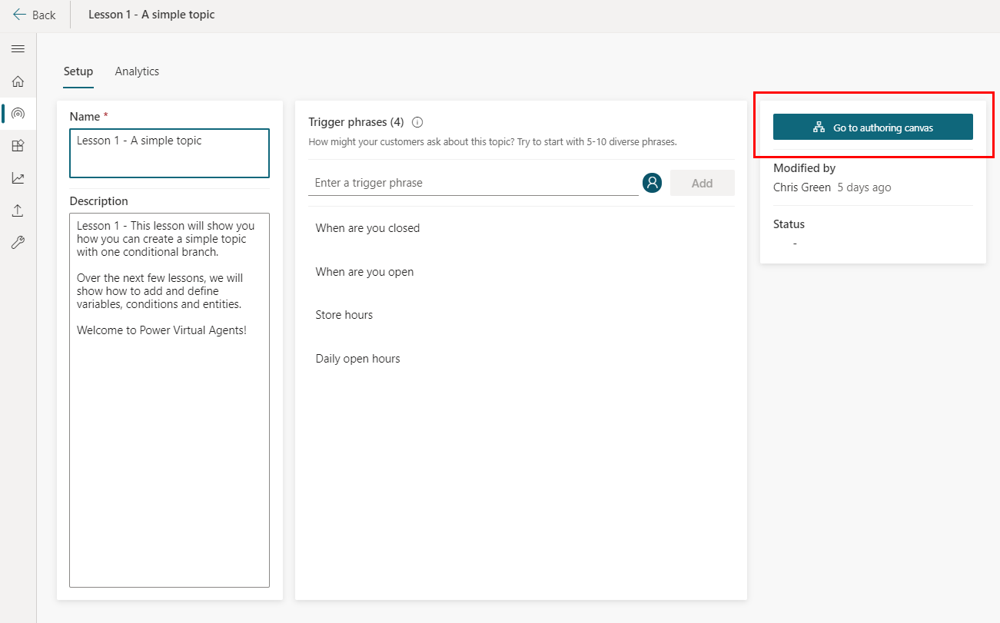
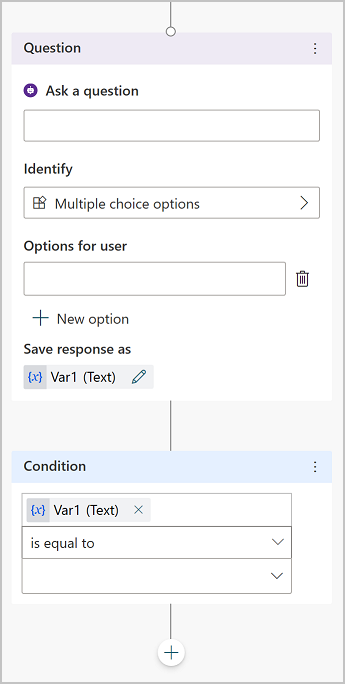
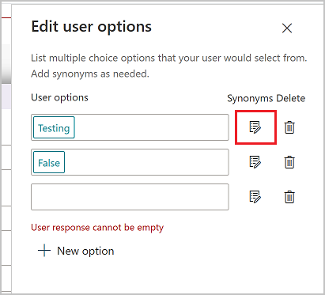
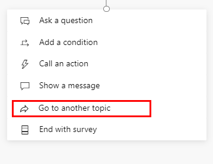
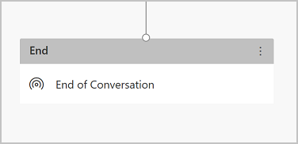
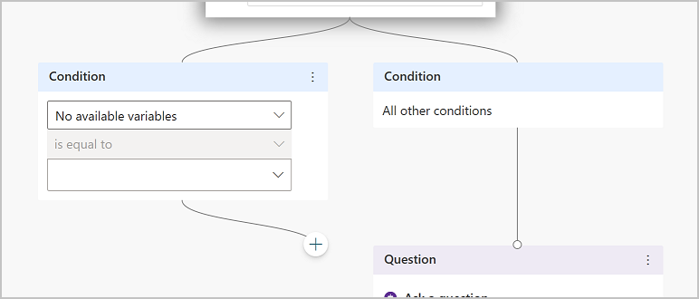

# Create and edit topics in your Power Virtual Agents bot in Teams

> [!div class="op_single_selector"]
> - [Web service (https://powerva.microsoft.com)](../authoring-create-edit-topics.md)
> - [Teams (online or app)](authoring-create-edit-topics-teams.md)

In Power Virtual Agents, a topic determines a how a bot responds to a question from a user. 

You can create topics by [customizing provided templates](authoring-template-topics-teams.md), create new topics from scratch, or [get suggestions from existing help sites](advanced-create-topics-from-web-teams.md). 

All topics have trigger phrases and conversation nodes.

Trigger phrases are phrases, keywords, or questions that a user is likely to type that is related to a specific issue. 

Conversation nodes are what you use to determine how a bot should respond and what it should do.

You don't need to be exact with trigger phrases - the bot can determine what the user meant (their "intent") and match it to the right topic.

For example, a user might type "Open hours" into your bot, which will match that to the trigger phrases for the **Store hours** topic. 
The bot then asks which store the customer is interested in, and displays the hours the store is open.

You can see how the bot conversation works in practice by testing it in the **Test bot** pane. This lets you fine-tune the topic until you're ready to share it.

> [!Note]
> You can have up to 1,000 topics in a bot and up to 30 nodes in a topic.

## Prerequisites

[!INCLUDE [Medical and emergency usage](includes/pva-usage-limitations-teams.md)]

## Use system and sample topics

When you create a bot, a number of topics are automatically created.

  
  - Four **User Topics** that can be used as [lesson topics](authoring-template-topics-teams.md) can to help understand how to make a bot conversation.
  - A number of **System Topics**. We recommend you keep these and use them until you are comfortable with creating an end-to-end bot conversation.

You can edit both of these topic types in the same manner as for topics you create but you can't delete them.

## Create a topic

1. Go to the **Topics** tab on the side navigation pane to open the topics page.

   

   :::image type="content" source="media/topics-menu-teams.png" alt-text="Select Topics on the side navigation menu":::

1. On the topics page, select **New topic**.

   :::image type="content" source="media/topics-new-teams.png" alt-text="Select New topic at the top of the Topics page":::

1. Specify a name, description, and one or more trigger phrases for the topic.

   A trigger phrase is what someone might start a conversation with. It's best to use short phrases and keywords rather than long sentences.  
   Remember you don't need to enter in all the different ways someone might ask a question - the bot can determine what the user meant (their "intent") and match it to the right topic.

   

1. Select **Save topic** to add the topic to the topics list.

## Design the topic's conversation path

A topic's conversation path is how the bot will respond to a person's questions and responses. It consists of special "nodes" that prompt the person with questions or answers. When the bot receives responses to the questions, it determines whether to provide an answer or look for another topic.

1. In the topic details for the topic you want to edit, select **Go to authoring canvas**.

   

1. Power Virtual Agents opens the topic in the authoring canvas and displays the topic's trigger phrases. The authoring canvas is where you define the conversation path between a customer and the bot.

 
1. For existing or system topics, a number of nodes will automatically be created. You can edit these nodes just as you can for other nodes.

1. When you create a new topic, a **Trigger phrases** node and a blank **Message** node are inserted for you. 

1. You can add additional nodes by selecting the **Plus** (**+**) icon on the line or branch between or after a node.

   

### Insert nodes

When adding a node, you can choose from five options. Each option has a specific node or nodes that will be inserted into the conversation path.

You can:

- **Ask a question**
- **Add a condition**
- **Call an action**
- **Show a message**
- **Go to another topic**
- **End the conversation**

  :::image type="content" source="media/topics-nodes-teams.png" alt-text="When adding a node, you can choose from five options":::
 
Additionally, you can **Branch based on a condition**:

#### Ask a question:

1. To have the bot ask a question and get a response from the user, select **+** to add a node, and then **Ask a question** to add a new **Question** node.

    

1. Enter the question phrase in the first text box, **Ask a question**.

1. You can choose from several options for the user’s response in the **Identify** field. 
   
   These options determine what the bot should be listening for in the user's response. 
   
   For example, they could be multiple choice options, a number, or a specific string. 
   
   To understand more about the different options, see [Use entities in a conversation](advanced-entities-slot-filling-teams.md#use-entities-in-a-conversation).

1. Depending on what you choose in the **Identify** field, you can enter what options the user should have. 
   
   For example, if you select **Multiple choice options**, you can then enter the options the user can specify in the **Options for user** field. Each option is presented as a multiple choice button to the user, but users can also type in their answer in the bot.

   The conversation editor creates separate paths in the conversation, depending on the customer's response. The conversation path leads the customer to the appropriate path for each user response. You can add additional nodes to create branching logic, and specify what the bot should respond with for each variable.

1. You can [save the user response in a variable](authoring-variables-teams.md) to be used later. 

> [!TIP]
> You can define synonyms for each option. This can help the bot to determine the correct option in case it isn't clear what the user's response should be mapped to.
> 1. Select the menu icon on the top of the **Question** node, and then select **Options for user**.
>
>    
>
> 1. Select the **Synonyms** icon for the option you want to add additional keywords to. 
>
>    
>
> 1. Add the keywords individually, and then once you're done, select **Done** to return to the **Authoring canvas**.

#### Call an action

You can [call Power Automate Flows](advanced-flow-teams.md) by selecting **Call an action**.
 

#### Show a message

1. To specify a response from the bot, select **+** to add a node, and then **Show a message** to add a new **Message** node.

1. Enter what you want the bot to say in the text box. You can apply some basic formatting, such as bold, italics, and numbering. 
   
   You can also [use variables that you have defined elsewhere](authoring-variables-teams.md) in your bot conversation.

#### Go to another topic

1. To automatically have the bot move to a separate topic, select **+** to add a node, and then **Go to another topic**.

1. In the flyout menu, select the topic the bot should divert to. For example, you might want to send the user to a specific topic about the closure of a store if they ask about store hours for that store.

    

#### End the conversation

When you end the conversation, you can have a survey appear that asks the user if their question or issue was answered or resolved correctly. This information is collected under the [customer satisfaction analytics page](analytics-csat-teams.md).

1. At the end of a response that resolves the user's issue or answers the question, select **End the conversation**.

    

1. To end with a customer satisfaction survey, select **End with survey**.
    
    

1. Select **Transfer To Agent** to insert a hand-off node that will link with your configured hand-off product. You can also enter a private message to the agent. This requires you to [use the Power Virtual Agents app online to configure it](../configure-generic-handoff.md).

    

#### Branch based on a condition

1. To add branching logic based on [variables](authoring-variables-teams.md), select **+** to add a node, and then **Add a condition** and **Branch based on a condition**.

1. Choose the variable you want to use to determine if the bot conversation should branch at this point. 

    

### Delete nodes

1. Select the menu icon on the top of the node's title.

1. Select **Delete**.

    

## Test and publish your bot

[Test your bot](authoring-test-bot-teams.md) when you make changes to your topics, to ensure everything is working as expected.

Once you've finished designing and testing your bot, you can consider [publishing it](publication-fundamentals-publish-channels-teams.md) so other team members can use it.

