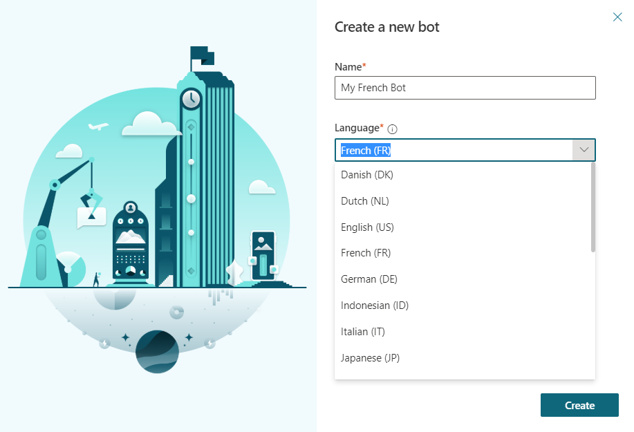

# Supported languages

[!INCLUDE ]

You can create chatbots in Power Virtual Agents in a number of languages. This means that your bots can reach a much broader audience and engage with more markets all around the world.

The current public preview experience of language support lets you create a new bot in one of the languages listed in this article. During public preview, the content of the bot will be localized, but the UI will remain in English.

## Specify a language for your bot

You specify the target language when you first [create a bot](authoring-first-bot-teams.md).

**To create a new bot in your target language**

1. In the **Create a new bot** window, select **Language**.

2. Choose the language you want to use. Some languages are listed under **Preview**, as described in the list of supported languages later in this article.

    

## Default content in the target language

After your new bot has been created, you'll notice that it already has content in the target language, including the **System Topics** and the template **User Topics**.

You can now move on to creating new topics for your bot, authoring bot trigger phrases, and creating bot messages in your target language.

When you've created your own topic in the target language, you can test the bot in the chat canvas and see how well it understands user input and responds in that language.

## List of supported languages

Power Virtual Agents supports languages in three stages. The stage indicates how well the bot can understand user input in that language, with general availability being the strongest, followed by preview, and then experimental.

| Language | Support |
| ---- | -----------|  
|Chinese (Simplified)        | Preview |
|Chinese (Traditional)       | Preview |
|Danish                      | Preview |
|Dutch                       | Preview |
|English                     | General availability |
|French                      | Preview |
|German                      | Preview |
|Hindi                       | Experimental |
|Indonesian                  | Preview |
|Italian                     | Preview |
|Japanese                    | Preview |
|Korean                      | Experimental |
|Norwegian                   | Preview |
|Polish                      | Experimental |
|Portuguese (Brazilian)      | Preview |
|Russian                     | Preview |
|Spanish                     | Preview |
|Swedish                     | Preview |
|Turkish                     | Preview |

### See also

[Data locations for organizations using Power Virtual Agents](data-location-teams.md)
