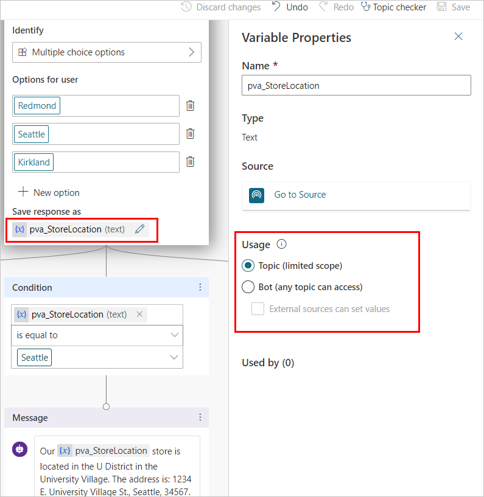
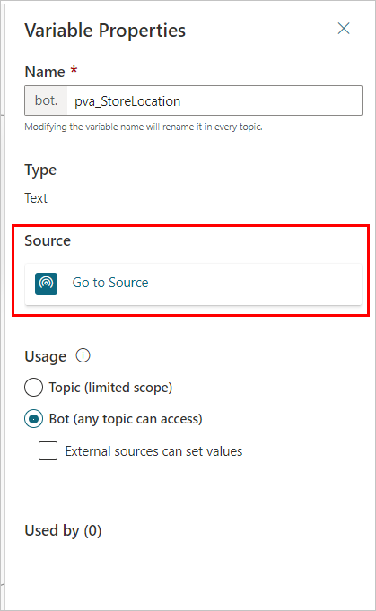
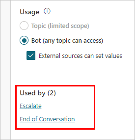
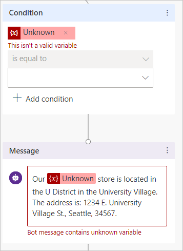

# Reuse variables across topics in Teams

Select the version of Power Virtual Agents you're using here:

> [!div class="op_single_selector"]
> - [Power Virtual Agents web app](../authoring-variables-bot.md)
> - [Power Virtual Agents app in Microsoft Teams](authoring-variables-bot-teams.md)

[!INCLUDE [cc-beta-prerelease-disclaimer](includes/cc-beta-prerelease-disclaimer-teams.md)]

[Variables](authoring-variables-teams.md) let you save responses from your customers. For example, you can save a customer's name in a variable called `UserName`. The bot can then address the customer by name as the conversation continues.

However, you can also make variables into **bot variables**, so that they apply across the entire bot.

## Prerequisites

- [!INCLUDE [Medical and emergency usage](includes/pva-usage-limitations-teams.md)] 

## Set bot variables

After you set a bot variable, it will be available to all topics. 

When you select the `{x}` button in a node when you're editing a topic, you'll see the list of variables you can use, sorted in alphabetical order. Bot variables are at the top because they start with `bot.`.

**Reuse a variable across topics by setting it as a bot variable:**

1. Select any variable in the authoring canvas.

1. On the **Variable properties** pane, under **Usage**, select **Bot (any topic can access)**.

1. The variable name will be given a prefix string `bot.`, to differentiate it from the topic-level variables. For example, the variable `UserName` is now shown as `bot.UserName`. 

    
 
>[!NOTE]
>A bot variable's name must be unique across all topics. In the case of a conflict, you'll need to rename the variable before saving your change. 

## Manage bot variables

After you've created a bot variable, you can see where it's first defined and what other topics are using it. 

**Go to the source of a bot variable's definition:**

1. Select any variable in the authoring canvas.

1. On the **Variable properties** pane, select **Go to source**. 

    
 
This will take you to the node in the topic where the bot variable was created. 

**Find all topics using a bot variable:**

1. Select any bot variable in the authoring canvas.

1. On the **Variable properties** pane, in the **Used by** section, select any of the topics where the variable is used to go straight to that topic and node. 

    
 
## Delete bot variables

When removing a bot variable used in other topics, the references to that variable in the topics will be marked as `Unknown`. 

You'll receive a warning about deleting the bot variable before you can confirm the operation.

  
Nodes that contain references to the deleted bot variable will tell you they contain an unknown variable. 

Topics with nodes that contain references to deleted bot variables might stop working. Ensure that you remove or correct all the topics that were using the deleted variable before publishing.

## Advanced use of bot variables

For more details on complex and advanced scenarios using bot variables, including authentication, external sources, and initialization flows, [see the Power Virtual Agents web app version of this topic](../authoring-variables-bot.md).

## Related links

- [Use variables](authoring-variables-teams.md)

