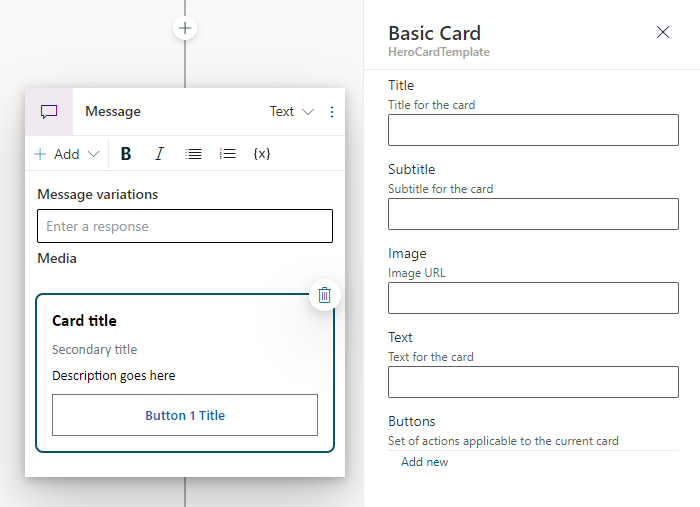
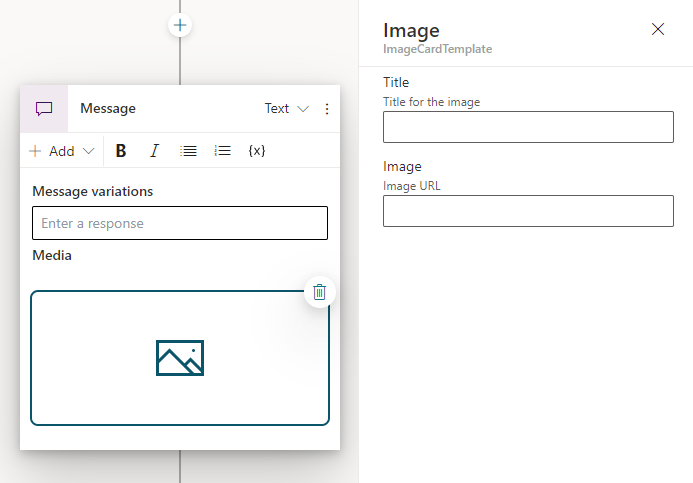
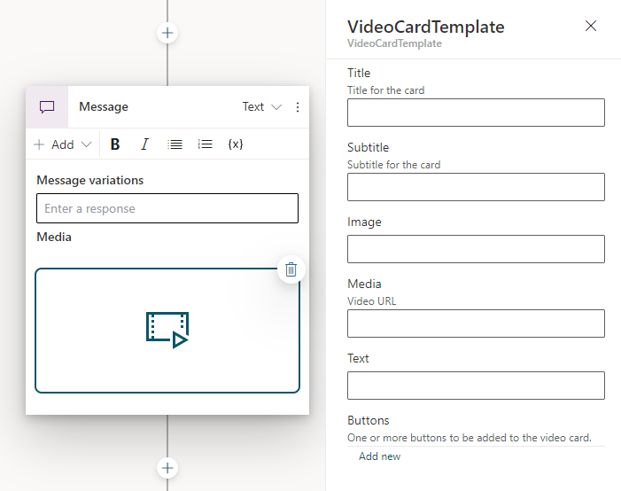
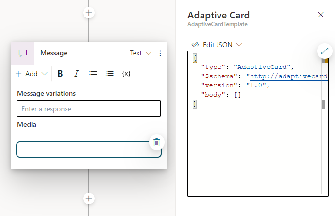
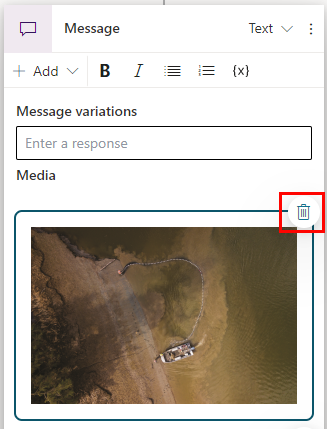

# Add cards to bot responses

[!INCLUDE [Build 2022](includes/build-22-disclaimer.md)]

Cards add rich multimedia responses to **Question** and **Message** nodes. With cards, you can go beyond basic text replies by adding images, videos, and interactive elements.

There are several types of cards that provide different experiences to users. All types allow you to preview them on the authoring canvas in real-time.

## Prerequisites

- [Create and edit topics](authoring-create-edit-topics.md)
- [Use variables](authoring-variables.md)

## Basic Card

A **basic card** is a general purpose card that can be used in a variety of situations to add text, images, and interactive elements to bot responses.

1. On the authoring canvas, select the plus (**+**) icon. Then select **Show a message** to add a new **Message** node.

1. Select the **Message** node. Then select **Add** and choose **Basic Card**.

1. In the properties pane, populate the fields.

## Image Card

An **image card** is a specialized card used to show an image to a user.

1. On the authoring canvas, select the plus (**+**) icon. Then select **Show a message** to add a new **Message** node.

1. Select the **Message** node. Then select **Add** and choose **Image**.

1. For **Image URL**, enter the URL for your image.

1. Optionally, enter a **Title** for your card.

## Video Card

A **video card** is a specialized card used to show a video to a user.

1. On the authoring canvas, select the plus (**+**) icon. Then select **Show a message** to add a new **Message** node.

1. Select the **Message** node. Then select **Add** and choose **Video**.

1. For **Media**, enter the URL for the your video.

1. Optionally set additional properties, such as the card's **Title** and **Text**.

## Adaptive Card

An **adaptive card** is fully customizable card that you can tailor to your needs. You can author adaptive cards by hand in JSON, or use the [Adaptive Cards Designer](https://adaptivecards.io/designer/) to create a card in a drag-and-drop interface.

> **IMPORTANT**
> Power Virtual Agents only supports Adaptive Cards schema version 1.3 or lower.

1. On the authoring canvas, select the plus (**+**) icon. Then select **Show a message** to add a new **Message** node.

1. Select the **Message** node. Then select **Add** and choose **Adaptive Card**.

1. For **Edit JSON**, enter the JSON for your Adaptive Card.

    To open an expanded view of the JSON editor select **Expand**.

    

## Manage multiple cards in the same node

If you add more than one card to a node, two display options will appear in the node's menu when a card is selected:

- **Carousel** displays one card at a time.
- **List** displays all cards in a vertical list.

You can remove cards from a node by selecting the **Delete** button in the corner of the card.

