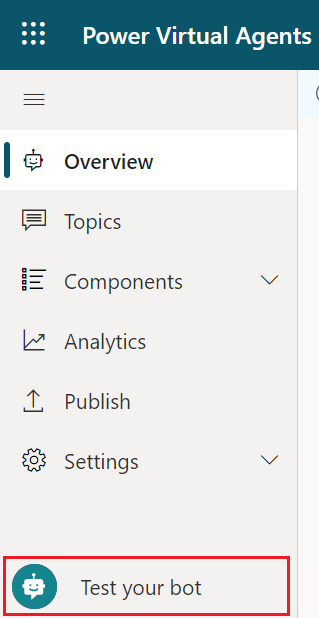
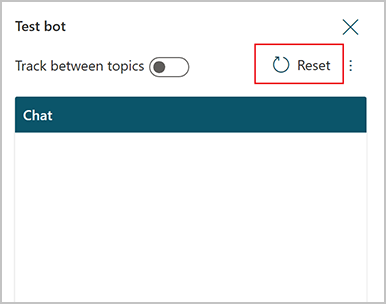
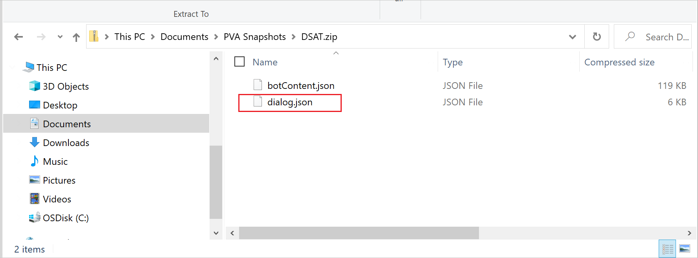

# Test your Power Virtual Agents bot

As you design your bot in Power Virtual Agents, you can use the **Test bot** pane to see how the bot leads a customer through the bot conversation.

To help you find and fix unexpected behavior, you can enable tracking between topics to take you through the bot conversation step-by-step, and go to the corresponding node in the authoring canvas.

## Test a topic in the Test bot pane

1. If the **Test bot** pane is hidden, open it by selecting **Test your bot**.

   

1. It's a good idea to select **Reset** at the top of the **Test bot** pane to clear previous conversations. Clearing previous conversations makes it easier to see the flow of the topic you want to see without getting confused by previous conversations.

   

1. At the **Type your message** prompt at the bottom of the **Test bot** pane, enter a trigger phrase for the topic.

   The trigger phrase starts the topic's conversation, and the **Test bot** pane displays the bot responses and user response choices you specified.

1. Continue the conversation, testing that it flows in the intended as [designed in the topic](authoring-create-edit-topics.md).

1. Select a response in the **Test bot** pane, which will take you to the response in the conversation editor for that topic. The authoring canvas displays highlighted nodes in green.

  

You can return to the authoring canvas for the topic  at any time to revise it's conversation path. The **Test chat** pane will automatically refresh itself when you save changes to a topic.

## Save conversation snapshots

While testing your bot in the **Test bot** pane, you can use the **Save snapshot** command to get conversational diagnostics data. This data can help you troubleshoot issues, such as the bot not responding in the way you expect.

> **WARNING**
> The snapshot contains all of your bot content, which may include sensitive information.

1. At the top of the **Test bot** pane, select the menu icon (three vertical periods) and then **Save snapshot**.

    

1. In the window that appears, select **Save**.

    

1. The bot's content and conversational diagnostics will be saved in a .zip archive file called *DSAT.zip*.

    

1. The *DSAT.zip* file contains two files: *botContent.json* and *dialog.json*.

    1. *dialog.json* contains conversational diagnostics, including detailed descriptions of errors.

        

    1. *botContent.json* contains the bot's topics and other content, including entities and variables used in the bot.

Help us improve Power Virtual Agents by flagging issues with the **Flag an issue** command on the test bot pane. This submits your conversation ID to Microsoft, which is a unique identifier that Microsoft uses to troubleshoot the issue of the conversation. Other information, such as that in the *DSAT.zip* file, is not sent when you flag an issue.

All information collected is anonymous and will be used to help improve bot quality.

