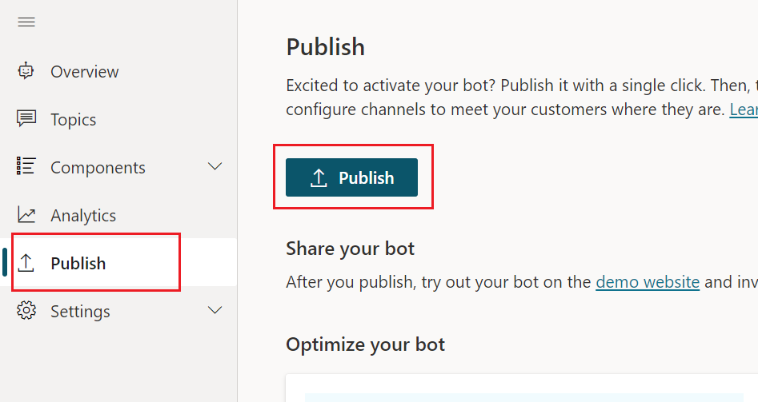

# Key concepts - Publish your bot

[!INCLUDE [Build 2022](includes/build-22-disclaimer.md)]

With Power Virtual Agents, you can publish bots to engage with your customers on multiple platforms or channels. These include live websites, mobile apps, and messaging platforms like Microsoft Teams and Facebook.

After you've published at least once, you can connect your bot to more channels.

Each time you want to update your bot, you publish it again from within the Power Virtual Agents app itself. Publishing your bot will update the bot across all the channels where you've inserted or connected your bot.

>
> 
>

## Publish the latest bot content

You need to publish the bot at least once before your customers can interact with it or before you can share it with your teammates. After the first publish, you can publish the bot again whenever you'd like your customers to engage with the latest bot content.

1. On the left side pane, select the **Publish** tab.

1. Select **Publish** to make the latest bot content available to your customers.

    

    The publishing process will take less than a few minutes as it checks for errors in the latest bot content.

1. After publishing completes, select the **demo website** link. The link will open a new tab and display a prebuilt demo website where you and your team can interact with the bot. The demo website is useful to gather feedback from stakeholders involved in the bot.

For details on updating the welcome message and help text on the demo website, go to [Configure the demo website and add the bot to your live website](publication-connect-bot-to-web-channels.md).

> **TIP**
> **What's the difference between the test chat and the demo website?**  
> On the demo website, you can share a URL with members of your team, or other stakeholders who want to try out the bot.  However, the website isn't intended for production use, and you shouldn't use it directly with customers.  
> You can use the test chat to see whether conversation flows as expected, and to spot any errors during the bot creation process.

