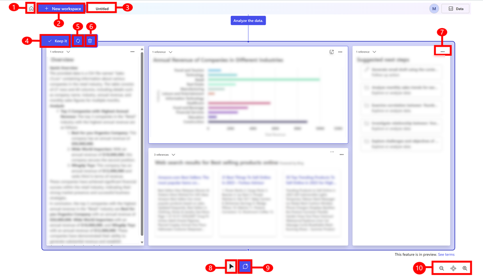

# Explore a topic (preview)

[This article is prerelease documentation and is subject to change.]

When you can ask Project "Sophia" a question or upload data and ask questions about the data, it generates a AI-powered blueprint. 

It's also beneficial to select **Domains** when you use Project “Sophia”. Choosing a domain provides a better understanding of the context of your question. For instance, in the context of sales and marketing, the terms "hunters" and "farmers" hold distinct meanings that might not be apparent without that context. Similarly, there are common acronyms that can mean something different based on context.

Follow these steps to ask a question:

1. Go to [https://projectsophia.microsoft.com](https://projectsophia.microsoft.com).
1. From the Home screen, select **New workspace**.
1. From the top right, select **Domains** to optimize  responses your specific area of interest. 
1. Enter your question in the text box and then select **Generate**.

You'll get an AI-powered blueprint in response to your question including an overview and suggested next steps.

## Ask questions about your data

You can upload a data file and ask questions about the data. The [supported file formats](ask-question.md#supported-data-files) are .csv, .xlsx, and .pdf. In future releases, you will be able to **connect to data** instead of uploading data.

1. Use one of the following methods to ask questions about your data:
   - On the Home screen, select **go** on the **Onboarding** tile > **Exploratory** > **upload data or use sample data**. You can also use the sample sales data provided to familiarize yourself with Project "Sophia".
   - On the Home screen, select **New workspace** > **Add data** > **Upload files**

1. Select the file name and then select **Open**.
1. From the top right, select **Domains** to optimize  responses your specific area of interest. 
1. Select **Generate** or enter your question in the text box and then select **Generate**.

Your data is analyzed to create a blueprint that provides valuable insights, charts, and actionable steps.

### Supported data files

You can upload a PDF (.pdf), CSV (.csv), and Excel (.xls) file. The following limitations apply to file uploads:

- The maximum supported file size is 10 mb.
- For .csv (comma-separated values) files, the data within the file needs to be separated by commas. 
- Excel:
  - Column header in the first row only.
  - No more than 10 tables and max 50 columns for each table.
  - Can’t contain merged cells.
  - Elements such as images, charts and macros can't be processed.
- PDF:
  - The file must contain selectable text. You can test it by trying to highlight text within the PDF. If you can’t select or highlight the text, then it can't be processed.
  - Use original digital documents or PDF that are converted directly from word processors or other digital sources. A scanned PDF will not work.
-	Encrypted or password-protected files aren’t supported.
- If a PDF contains tables make sure the borders are clearly outlined. Avoid using any contrasting colors to differentiate between rows and columns.

### Work with content

 You can take the following actions when content is generated:

> [!div class="mx-imgBorder"]
> 

Legend:

1. **Home**: Go to the Home screen.
1. **New workspace**: Opens a blank canvas where you can explore and [ask questions](ask-question.md) related to your business. Or you can upload business data and [ask questions about the data](ask-question.md#ask-questions-about-your-data). When you ask a question, a workspace is created which can be accessed from the Home screen.
1. **Workspace name**: To rename a workspace, select the default name **Untitled** and rename it. 
1. **Keep it**: Saves the generated content. Select the **Untitled** text box and enter a name for the generated workspace. If you don’t save the generated information, the system automatically saves it as, **Untitled**. You can access all workspaces from the Home screen.
1. **Regenerate**: Regenerates the results or select **Regenerate with new data** to replace with another data set instead of starting over. The **Regenerate** option can generate different results, but the level of difference depends on the specificity of the question asked. For example, a general question such as "tell me something interesting about my data," generates different results, whereas as question such as "show me my top 10 accounts based on last years sales numbers" generate similar results.
1. **Discard**: Deletes the generated content.
1. **Show work and discard**: Option to view more information about the generated content or discard it. **Show work** provides clarity on how the content was generated and what skills were used to produce the content. **Discard** Removes the block of research. 
1. **Select tool**: Use the **Select tool** to select a template or a block. 
1. **AI cursor**: Use the [AI cursor](ai-cursor.md) to ask questions about the content on a blueprint or a block of content in the blueprint.
1. **Zoom and pan**: Use the zoom and pan options to quickly navigate content. The pan button provides an overview of the entire workspace, which lets you navigate and zoom in and out on a blueprint.

