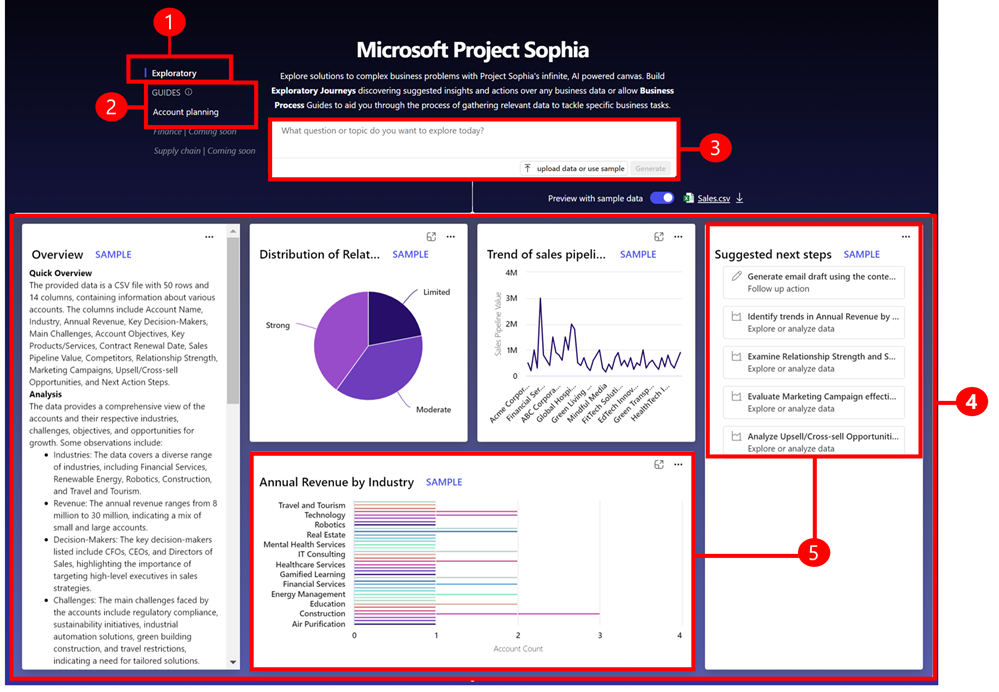

# Project “Sophia” overview (preview)

[This article is prerelease documentation and is subject to change.]

Project “Sophia” is a new generation of AI-first business app that helps users with complex, cross functional tasks, and offers a new way to discover, visualize, and interact with business data. 

Project “Sophia” offers has an AI- powered, user-friendly research canvas and large language model powered blueprints. The research canvas helps you create exploratory journeys and understand business data with AI-generated charts and insights without the need to mine data and create visuals. The app provides quick insights and recommends the next steps. You can start with a question and explore different options. Or you can continue iterating until you get the best possible outcome. 

> [!IMPORTANT]
> - Project “Sophia” is only available in the US region.
> - This is a preview feature. Preview features aren’t meant for production use and may have restricted functionality. These features are available before an official release so that customers can get early access and provide feedback.
> - By accessing or using the Project “Sophia”, you accept the [Microsoft Preview Terms of Service](https://go.microsoft.com/fwlink/?linkid=2242556).
> - Project “Sophia” uses Microsoft Bing and your research queries will be directed to Bing, which is governed by the Bing section of the [Microsoft Privacy Statement](https://privacy.microsoft.com/en-us/privacystatement).
> - This capability may be subject to usage limits or capacity throttling.

## Onboarding screen

The first time you sign in, you see the **Onboarding** screen where you can interact with Project "Sophia" using the **Exploratory** and **Guides** options. The following screenshot provides more details about the interaction: 

> [!div class="mx-imgBorder"]
> 

You can also go back to the **Onboarding** screen, by going to the Home screen and then select **Go** on the **Onboarding** tile.

Legend

1. **Exploratory**: Offers a blank canvas where you can explore and ask questions related to your business. Or you can upload business data and ask questions about the data. Project "Sophia" uses the uploaded data to generate insights and suggests next actions.
2. **Guides**: Helps you through the process of gathering relevant data to tackle specific role-based business tasks. For preview the account planning guide is supported. Guides for sales territory planning, supply chain optimization, and fiscal year close are coming soon.
3. **Question**: Enter your question in the text box and then select **Generate**.
4. **Blueprint**: The results that are generated when you ask a question or upload data. You can also generate a new blueprint by selecting the suggested next step.
5. **Block**: Example of the different blocks of content that is generated.

## Home screen

The next time you sign in to Project "Sophia," you'll see the Home screen. The following screenshot shows how to navigate it:

> [!div class="mx-imgBorder"]
> 

Legend

1. **Home**: Takes you to the Home screen as shown in the screenshot.
2. **New workspace**: Opens a blank canvas where you can explore and ask questions related to your business. You can also upload data and ask questions about the data. When you ask a question, a workspace is created that you can access from the Home screen.
3. **Guides**: Helps you through the process of gathering relevant data to tackle specific role-based business tasks. For preview the account planning guide is supported. Guides for sales territory planning, supply chain optimization, and fiscal year close are coming soon.
4. **Documentation**: Access online help documentation.
5. **Onboarding**: Select **Go** to go to the [**Onboarding**](overview.md#onboarding-screen) screen.
6. **Workspace**: When you ask a question or upload data and inquire about the data, a workspace is generated. You can access all your workspaces from the Home screen.
7. **Workspace name**: The name of your workspace. The default title of a workspace is **Untitled**. You can select the title and rename it.

## Waiting room

If Project "Sophia" reaches its full capacity during the preview period, you're placed in a waiting room queue until there's more capacity. You can remain in the waiting room or sign up to be notified when Project "Sophia" is available. When the product is released to the public, there will be no waiting room.

> [!Note]
> If you chose to stay in the waiting room, don't refresh your browser as this will put you at the back of the queue.

## Authenticated and unauthenticated experience

If you don't sign in to Project "Sophia," you can't ask questions or upload any data. However, you can still access a limited unauthenticated experience where you can use sample data and get a feel for of Project "Sophia," and view suggested next steps.
